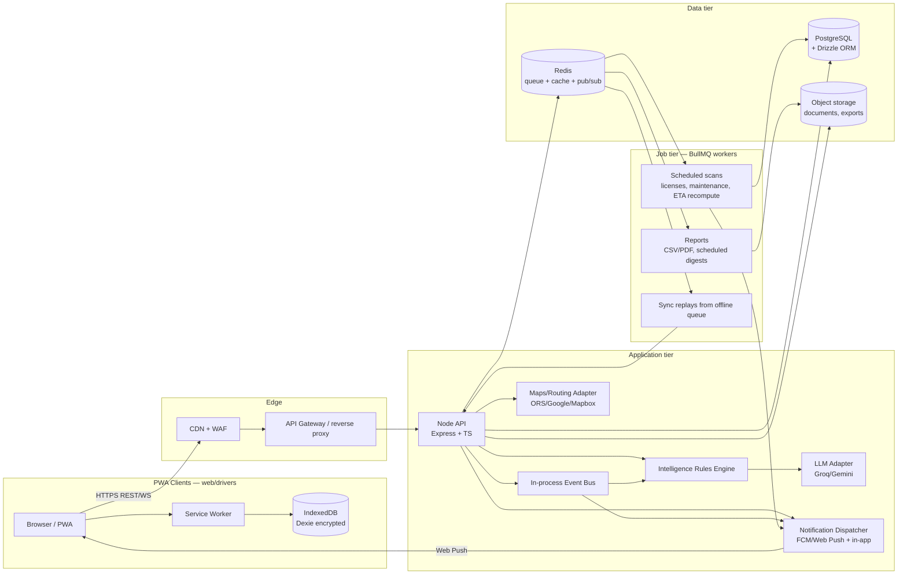
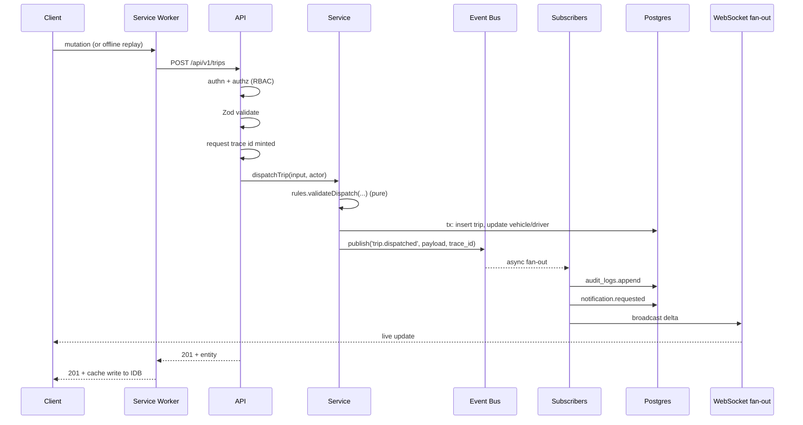

# 01 — System Architecture & Tech Stack

**Owns:** runtime topology, service boundaries, data flow, event spine, observability, DR,
environment matrix. For schema see `02`, for endpoints see `03`, for offline see `04`, for
security see `10`, for deployment pipeline see `14`.

---

## 1. Architecture Principles

1. **Monolith with seams.** One deployable backend service today; module boundaries
   (`modules/<domain>`) map cleanly to future services. No premature microservices.
2. **Server-authoritative.** The API is the single source of truth; offline writes are
   replayed through it (see `04`).
3. **Event-driven side effects.** Mutations emit domain events. Audit, notifications,
   scoring, anomaly detection are subscribers — never inline calls.
4. **Deterministic before probabilistic.** Intelligence is rules-first; LLMs only wrap the
   same computed numbers (see `06`).
5. **Graceful degradation everywhere.** Every external dependency (maps, routing, LLM, push)
   has a fallback path that the UI can render without breaking.
6. **Plan for failure, not just success.** Every async job is idempotent, every queue is
   durable, every external call is time-boxed.

## 2. High-Level Topology



### 2.1 why monolith + seams
A single backend keeps transactional consistency for the dispatch chain (vehicle, driver,
trip, audit, timeline all in one DB write). The `modules/<domain>` folders enforce that no
module imports another module's repository directly — only its service or its published
events. When scale demands it, the seams already exist.

## 3. Layered Backend

Each module owns four layers:

| Layer | Responsibility | Allowed to |
|---|---|---|
| `routes.ts` | HTTP I/O only | parse + validate request, call `service`, serialize |
| `service.ts` | Orchestration, authorization, events | call `repository`, other `service`s, emit events |
| `repository.ts` | Database I/O | Drizzle queries, multi-tenant scoping, soft-delete filter |
| `rules.ts` | Pure functions | No I/O. Inputs + outputs only. Unit-tested exhaustively. |
| `dto.ts` | Zod schemas | Validate input shape at the boundary, derive types from schemas |
| `events.ts` | Event contract | Declare the topic + payload shape this module publishes |

> **Rules never do I/O.** This is the contract that lets us unit-test all business decisions
> without spinning up Postgres or Redis. See `05-Business-Rules-Validation.md`.

## 4. Event Spine

In-process pub/sub backed by Redis streams for durability (the in-process bus is the fast
path; on publish we also `XADD` to Redis so workers can replay). Topics are domain-qualified
strings: `vehicle.created`, `trip.dispatched`, `maintenance.closed`, `fuel.log.created`,
`driver.score.changed`, `anomaly.fuel.detected`, `notification.requested`.

### 4.1 Event envelope
```ts
type DomainEvent<T = unknown> = {
  id: string            // event uuid — for idempotent consumers
  topic: string
  occurred_at: string   // ISO-8601 UTC
  actor_id: string | null
  organization_id: string
  entity: { type: string; id: string }
  payload: T
  trace_id: string      // propagates the request trace
}
```

### 4.2 Canonical subscribers
| Subscriber | Listens to | Does |
|---|---|---|
| Audit writer | every `*.created/updated/deleted/transitioned` | Append to `audit_logs` (best-effort, never blocks) |
| Notification dispatcher | `*.dispatched/*.completed/*.anomaly-detected/*.license-expiring` | Decide audience + channel, enqueue send |
| Anomaly detector | `fuel.log.created` | Compute deviation, write `fuel_anomaly_flags` |
| Maintenance scheduler | `trip.completed`, `maintenance.closed` | Recompute `maintenance_schedules` |
| Scoring worker | `trip.completed`, `maintenance.closed`, `anomaly.fuel.detected` | Recompute `driver_score_history` + `vehicle_health_scores` |
| Realtime fan-out | every user-visible topic | Publish to Redis pub/sub; clients subscribed via WS get the delta |

### 4.3 At-least-once + idempotency
Every subscriber tracks `processed_event_ids` (table `event_consumers(event_id, consumer_id,
processed_at) primary key`). On replay, already-processed events are skipped. **Every
side-effect write must be idempotent** — e.g. notification dispatch keys on
`(notification_fingerprint)` so a replay can't duplicate alerts.

## 5. Realtime

| Channel | Transport | Use |
|---|---|---|
| Per-user notifications | WebSocket (Redis pub/sub fan-out) | Bell badge, alert strip updates |
| Fleet map + digital twin | WebSocket (broadcast per org) | Pin moves, status color flips |
| KPI cards on Command Center | Poll 15s (fallback) + WS (preferred) | Numbers visibly update |
| Driver location stream | WS from driver PWA → API → Redis pub | Map live positions |

WS connection upgrades carry the access token in a query param (short-lived); the server
validates and closes on expiry; the client transparently re-authes with the refresh token.

## 6. Frontend Runtime

| Concern | Choice | Rationale |
|---|---|---|
| Build | Vite | Fast HMR, PWA plugin ecosystem |
| Routing | TanStack Router (file-based, type-safe) | End-to-end typed routes match RBAC |
| Server state | TanStack Query | Cache, retries, mutations, optimistic updates |
| Client state | Zustand (slices per feature) | Minimal, no provider tree noise |
| Forms | react-hook-form + Zod | Schema reused server-side |
| UI primitives | shadcn/ui + Radix + Tailwind | Accessible, themeable, copy-in |
| Charts | Recharts (default) + ECharts (heatmap/geo) | Coverage across doc 09 screens |
| Maps | React-Leaflet + Leaflet Routing Machine | Pluggable provider via `lib/maps` |
| Offline | Dexie (encrypted) + service worker | See `04` |
| i18n | i18next + react-i18next | Locale files under `messages/` |
| Notifications client | Web Push (VAPID) + in-app SSE fallback | `07` |
| Date/time | date-fns + tz format | UTC storage, locale display |

## 7. Backend Runtime

| Concern | Choice | Rationale |
|---|---|---|
| Runtime | Node 20 LTS + TypeScript | Blueprint alignment |
| HTTP | Express 4 → 5 (typed) | Familiar; we add strict Zod middleware |
| Validation | Zod (request, env, dto) | One schema language across stack |
| ORM | Drizzle ORM | SQL-first, typed, explicit migrations |
| DB | PostgreSQL 16 | CTEs, BRIN indexes, JSONB, RLS-ready |
| Sessions | JWT access (15m) + refresh (30d, rotate) | Stateless, revocable via `refresh_token_revoked` |
| Password | Argon2id (owl recommendations) | OWASP-aligned |
| MFA | TOTP via otplib; recovery codes; optional | `10` |
| Logging | Pino (JSON) → stdout | Log correlation by `trace_id` |
| Jobs | BullMQ (Redis) | Durable, retries, scheduled |
| Cache | Redis (response + computation) | ETAs, dashboard rollups |
| LLM | Adapter pattern — Groq or Gemini via env | `06` |
| Maps | Adapter pattern — ORS default | `12` |
| File storage | S3-compatible (MinIO local) | Documents, exports |
| Push | Web Push (VAPID) + FCM (future Android app) | `07` |
| Cookies/headers | strict SameSite, HSTS, CSP | `10` |

## 8. Request Lifecycle



## 9. Observability

| Signal | Stack | Notes |
|---|---|---|
| Logs | Pino → stdout → Loki (self-host) / CloudWatch | `trace_id`, `actor_id`, `event_id` always |
| Metrics | Prometheus + Grafana | RED metrics per endpoint; job lag |
| Traces | OpenTelemetry SDK → Tempo / X-Ray | Sampling 10% prod, 100% dev |
| Errors | Sentry (frontend + backend) | Release-tagged, PII-stripped |
| Uptime | Synthetic check `/healthz` + login flow | External probe |
| Alerting | Grafana → email/PagerDuty for sev-1/2 | See runbook in `14` |

### 9.1 Health endpoints
- `GET /healthz` — liveness (process up).
- `GET /readyz` — readiness (DB + Redis reachable).
- `GET /metrics` — Prometheus scrape (auth via mTLS in prod).

### 9.2 Trace propagation
A `trace_id` (uuid v7 for time-sortable) is minted at the edge if no header arrives, stamped
into every log line, every DB query (via `SET LOCAL app.trace_id`), every event, and every
outbound call. Use it to bridge frontend Sentry → backend logs → DB triggers.

## 10. Configuration & Environment

**Twelve-factor.** All config via env. Secrets via SOPS+age or cloud secret manager; never
in the repo, never in container layers. See `14-DevOps-Environments.md` for env-by-env matrix.

### 10.1 Required env (non-secret, illustrative — full list in `14`)
```
NODE_ENV=production
API_PORT=8080
DATABASE_URL=postgres://...
REDIS_URL=redis://...
S3_ENDPOINT=...
S3_BUCKET=transitops-documents
JWT_ACCESS_TTL=900        # 15m seconds
JWT_REFRESH_TTL=2592000   # 30d seconds
LLM_PROVIDER=groq         # groq|gemini|none
LLM_MODEL=llama-3.1-70b-versatile
LLM_TIMEOUT_MS=8000
MAPS_PROVIDER=ors         # ors|google|mapbox|osrm
MAPS_API_KEY=             # provider key where applicable
PUSH_VAPID_PUBLIC_KEY=...
PUSH_VAPID_PRIVATE_KEY=...
AUDIT_RETENTION_DAYS=365
DEFAULT_CURRENCY=INR
```

### 10.2 Feature flags
Flags live in Redis (per-org override) with code-served defaults. Pattern:
`if (flags.copilot_llm.enabledFor(orgId)) ...`. Default-off for risky flags (NL dashboard
query, FCM push) so they can ship dark and light progressively.

## 11. Failure Modes & Graceful Degradation

| Failure | Effect | Mitigation |
|---|---|---|
| LLM timeout / unavailable | Copilot output unavailable | Rules produce templated prose; UI shows fallback banner |
| Maps/routing timeout | Route Intelligence auto-fill disabled, manual entry re-enabled | Driver can still enter distance; UI marks estimate as manual |
| Redis unreachable | Realtime degrades; jobs pause | API continues; clients fallback to 15s polling; jobs resume on reconnect |
| Postgres unreachable | API returns 503 | `readyz` fails, LB stops routing; clients show offline-mode banner |
| Push delivery failure | Notification retains `failed` status | Retry with backoff 3× then dead-letter queue; in-app still visible |
| Object storage write fails | Document upload blocked | UI surfaces explicit error; retries on next action (idempotent key) |
| Telematics stream silent | Vehicle pegs "stale" after 5min | Notification: "Vehicle TN09AB1234 hasn't pinged in N minutes" |

## 12. Disaster Recovery

| Tier | RPO | RTO | Strategy |
|---|---|---|---|
| Hot (realtime) | ≤5min | ≤15min | WAL streaming to replica + PITR |
| Warm (records) | ≤1h | ≤2h | Nightly logical backup + S3 cross-region |
| Cold (audit exports) | ≤24h | ≤24h | Daily archival to object storage w/ immutability |

Recovery dry-run quarterly; documented runbook in `14`. Audit logs and `event_consumers`
table are *append-only* and survive restore — at minimum we must not lose audit on restore.

## 13. Module-Build Conventions (for AI agents)

- New cross-cutting infra goes in `apps/api/src/lib/` and must export a typed facade only.
- New jobs must be idempotent and declared in `lib/jobs/registry.ts` with a `queue` +
  `concurrency` + `retry` + `schedule`.
- New external adapter goes in `lib/<external>/` and must implement that domain's interface
  with a `noop`/in-memory variant for tests.
- New event topic must be added to `lib/events/topics.ts` and documented in this doc's §4.2.
- No `setTimeout`/`setInterval` in modules — use the job registry.
- No direct SQL outside repositories — call `repository.ts` of the owning module.

## 14. Acceptance — what "done for this doc" means

This doc is sufficient when an engineer can:
1. Stand up the full stack from `14`'s env matrix and hit `/readyz` 200.
2. Identify which module owns a given endpoint without grepping.
3. Trace a mutation end-to-end from client to audit log to WS broadcast.
4. Enumerate failure modes and their UI fallbacks for any external dependency.
5. Pick the right pattern (rules, repository, event, job) for a new requirement.