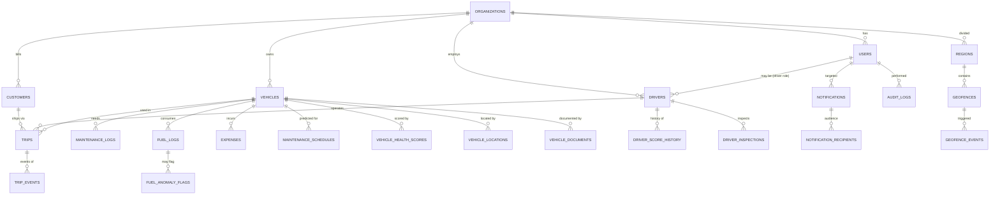

# 02 — Data Model & Schema

**Owns:** every entity, column, type, index, constraint, migration convention, and seed
data. For endpoints that mutate these tables see `03`. For business rules that govern
transitions see `05`. For tenancy/RLS see `10`.

---

## 1. Conventions

1. All keys are `uuid` (v4 generated by `gen_random_uuid()`, v7 used for time-sortable IDs
   where noted).
2. All timestamps are `timestamptz` UTC, default `now()`. Use `created_at`, `updated_at`,
   `deleted_at` everywhere. `updated_at` maintained by trigger; never via the ORM.
3. Multi-tenant tables carry `organization_id uuid not null references organizations(id)`.
4. Soft-delete via `deleted_at`; repository queries filter `deleted_at is null` by default.
   Use `Microsoft.includeTrashed()` style opt-in helper — see repo template in `01` §13.
5. Money stored as `numeric(14,2)`; distances km as `numeric(10,2)`; weight kg as
   `numeric(10,2)`; fuel liters as `numeric(10,3)`.
6. Booleans nullable where tri-state is meaningful; otherwise `not null default false`.
7. Coordinates `numeric(9,6)` (≥1m precision). Bounded by lat/lng domain checks.
8. JSONB only when the field is genuinely variable-shape (audit diffs, sync payloads,
   document metadata). Stored procedures / business values belong in real columns.
9. Every FK has `on delete restrict`; physical deletes happen only via the admin purge job
   (after audit retention expires — see `10`).
10. Enumerations are Postgres `text` columns with a `check` constraint listing allowed
    values — never `enum` types (migration pain). Wire format is kebab-case.

## 2. Entity-Relationship Overview



## 3. Master Tables

### 3.1 organizations
```sql
create table organizations (
  id              uuid primary key default gen_random_uuid(),
  name            text not null,
  slug            text not null unique,
  currency_code   text not null default 'INR',             -- ISO 4217
  locale          text not null default 'en',
  timezone        text not null default 'Asia/Kolkata',
  unit_system     text not null default 'metric' check (unit_system in ('metric','imperial')),
  settings        jsonb not null default '{}'::jsonb,      -- feature flags, thresholds override
  created_at      timestamptz not null default now(),
  updated_at      timestamptz not null default now(),
  deleted_at      timestamptz
);
```
For MVP exactly one row exists. Multi-tenant plumbed but not active (see `10`).

### 3.2 users
```sql
create table users (
  id                 uuid primary key default gen_random_uuid(),
  organization_id    uuid not null references organizations(id),
  name               text not null,
  email              citext not null unique,
  password_hash      text not null,
  role               text not null check (role in
                       ('admin','fleet_manager','driver','safety_officer','financial_analyst')),
  status             text not null default 'active' check (status in
                       ('active','invited','suspended','deactivated')),
  mfa_secret         text,                       -- encrypted at rest, see 10
  mfa_recovery_codes text[] not null default '{}',
  notification_prefs jsonb not null default '{}'::jsonb,
  last_login_at      timestamptz,
  created_at         timestamptz not null default now(),
  updated_at         timestamptz not null default now(),
  deleted_at         timestamptz
);
create index on users (organization_id, email);
create index on users (organization_id, role) where deleted_at is null;
```
- `email` is unique **globally** (login uses email+password) but row ownership belongs to org.
- `notification_prefs` shape: `{ "channels": ["in_app","push"], "types": { "license_expiring": true, ... } }`.
- `password_hash` is Argon2id. `mfa_secret` is encrypted with the tenant-KEK; never selectable
  by clients.

### 3.3 refresh_tokens
```sql
create table refresh_tokens (
  id              uuid primary key default gen_random_uuid(),
  user_id         uuid not null references users(id) on delete cascade,
  token_hash      text not null,
  family_id       uuid not null,                          -- rotation family; revoke on reuse
  user_agent      text,
  ip              inet,
  issued_at       timestamptz not null default now(),
  expires_at      timestamptz not null,
  revoked_at      timestamptz,
  replaced_by     uuid references refresh_tokens(id),
  created_at      timestamptz not null default now()
);
create index on refresh_tokens (user_id);
create index on refresh_tokens (token_hash);
```
Token reuse within a family → revoke entire family (refresh-token theft detection).

### 3.4 drivers
```sql
create table drivers (
  id                  uuid primary key default gen_random_uuid(),
  organization_id     uuid not null references organizations(id),
  user_id             uuid references users(id),           -- nullable for standalone profile
  name                text not null,
  license_number      text not null,
  license_category    text not null,                       -- e.g. 'LMV','HMV','HGTV'
  license_expiry_date date not null,
  contact_number      text not null,
  safety_score        numeric(5,2) not null default 100 check (safety_score between 0 and 100),
  overall_score       numeric(5,2) not null default 100,
  status              text not null default 'available' check (status in
                       ('available','on-trip','off-duty','suspended')),
  created_at          timestamptz not null default now(),
  updated_at          timestamptz not null default now(),
  deleted_at          timestamptz,
  unique (organization_id, license_number)
);
create index on drivers (organization_id, status) where deleted_at is null;
create index on drivers (organization_id, license_expiry_date);
```

### 3.5 vehicles
```sql
create table vehicles (
  id                   uuid primary key default gen_random_uuid(),
  organization_id      uuid not null references organizations(id),
  registration_number  text not null,
  name                 text,
  model                text,
  type                 text not null check (type in
                        ('truck','van','car','tractor','trailer','tanker','bus','ev','other')),
  max_load_capacity    numeric(10,2) not null check (max_load_capacity > 0),
  odometer             numeric(10,2) not null default 0 check (odometer >= 0),
  fuel_type            text not null default 'diesel' check (fuel_type in
                        ('diesel','petrol','cng','electric','hybrid')),
  acquisition_cost     numeric(14,2) not null check (acquisition_cost >= 0),
  acquisition_date     date not null,
  currency_code        text not null default 'INR',
  status               text not null default 'available' check (status in
                        ('available','on-trip','in-shop','retired')),
  retired_at           timestamptz,
  home_region_id       uuid references regions(id),
  created_at           timestamptz not null default now(),
  updated_at           timestamptz not null default now(),
  deleted_at           timestamptz,
  unique (organization_id, registration_number)
);
create index on vehicles (organization_id, status) where deleted_at is null;
create index on vehicles (organization_id, type);
```
Odometer is updated **only** by the trip-complete service and the maintenance-close service —
never directly writable from CRUD.

### 3.6 vehicle_locations (latest + history)
```sql
create table vehicle_locations (
  id           uuid primary key default gen_random_uuid(),  -- v7
  vehicle_id   uuid not null references vehicles(id),
  lat          numeric(9,6) not null check (lat between -90 and 90),
  lng          numeric(9,6) not null check (lng between -180 and 180),
  heading      numeric(5,2),
  speed_kmph   numeric(5,2),
  odometer_km  numeric(10,2),
  source       text not null default 'pwa' check (source in ('pwa','simulator','device','manual')),
  recorded_at  timestamptz not null,
  created_at   timestamptz not null default now()
);
create index on vehicle_locations (vehicle_id, recorded_at desc);
create index on vehicle_locations (recorded_at) where source <> 'manual';
-- Hot "latest known location" view for map + heatmap:
create materialized view vehicle_latest_locations as
  select distinct on (vehicle_id) *
  from vehicle_locations
  order by vehicle_id, recorded_at desc;
create unique index on vehicle_latest_locations (vehicle_id);
```
Brin index on `recorded_at` acceptable for huge tables. Locations older than 90 days roll to
cold storage via a nightly job.

### 3.7 vehicle_documents
```sql
create table vehicle_documents (
  id           uuid primary key default gen_random_uuid(),
  vehicle_id   uuid not null references vehicles(id),
  type         text not null check (type in
                 ('insurance','registration','fitness','pollution','permit','photo','other')),
  storage_key  text not null,                              -- S3 object key
  filename     text not null,
  mime         text not null,
  size_bytes   integer not null,
  expires_on   date,                                       -- for renewals (insurance, fitness)
  metadata     jsonb not null default '{}'::jsonb,
  uploaded_by  uuid not null references users(id),
  created_at   timestamptz not null default now(),
  deleted_at   timestamptz
);
create index on vehicle_documents (vehicle_id) where deleted_at is null;
create index on vehicle_documents (expires_on) where expires_on is not null;
```
Document **expiry** feeds notifications like license expiry — see `07`.

### 3.8 customers
```sql
create table customers (
  id              uuid primary key default gen_random_uuid(),
  organization_id uuid not null references organizations(id),
  name            text not null,
  contact_name    text,
  contact_email   citext,
  contact_phone   text,
  billing_address text,
  type            text not null default 'shipper' check (type in ('shipper','receiver','both')),
  created_at      timestamptz not null default now(),
  updated_at      timestamptz not null default now(),
  deleted_at      timestamptz,
  unique (organization_id, name)
);
create index on customers (organization_id) where deleted_at is null;
```

## 4. Operational Tables

### 4.1 trips
```sql
create table trips (
  id                  uuid primary key default gen_random_uuid(),
  organization_id     uuid not null references organizations(id),
  vehicle_id          uuid references vehicles(id),
  driver_id           uuid references drivers(id),
  customer_id         uuid references customers(id),
  source_label        text not null,
  source_lat          numeric(9,6),
  source_lng          numeric(9,6),
  destination_label   text not null,
  destination_lat     numeric(9,6),
  destination_lng     numeric(9,6),
  cargo_weight_kg     numeric(10,2) not null check (cargo_weight_kg > 0),
  planned_distance_km numeric(10,2) check (planned_distance_km > 0),
  planned_travel_mins integer,
  estimated_fuel_l    numeric(10,3),
  estimated_fuel_cost numeric(14,2),
  actual_distance_km  numeric(10,2),
  actual_travel_mins  integer,
  fuel_consumed_l     numeric(10,3),
  revenue_amount      numeric(14,2),                        -- per-trip revenue (see 11)
  cargo_description   text,
  status              text not null default 'draft' check (status in
                        ('draft','dispatched','in-transit','completed','cancelled')),
  dispatched_at       timestamptz,
  started_at          timestamptz,
  completed_at        timestamptz,
  cancelled_at        timestamptz,
  cancel_reason       text,
  planned_departure_at timestamptz,
  planned_arrival_at  timestamptz,
  created_by          uuid not null references users(id),
  created_at          timestamptz not null default now(),
  updated_at          timestamptz not null default now(),
  deleted_at          timestamptz
);
create index on trips (organization_id, status) where deleted_at is null;
create index on trips (vehicle_id, dispatched_at desc);
create index on trips (driver_id, dispatched_at desc);
create index on trips (customer_id) where deleted_at is null;
```

### 4.2 trip_events (the per-trip timeline / status changes)
```sql
create table trip_events (
  id           uuid primary key default gen_random_uuid(), -- v7
  trip_id      uuid not null references trips(id) on delete cascade,
  event_type   text not null check (event_type in
                  ('created','dispatched','enroute','position','checkpoint',
                   'delayed','arrived','pod-attached','completed','cancelled')),
  lat          numeric(9,6),
  lng          numeric(9,6),
  odometer_km  numeric(10,2),
  note         text,
  payload      jsonb not null default '{}'::jsonb,         -- POD doc key, checkpoint id, etc.
  recorded_by  uuid references users(id),
  recorded_at  timestamptz not null,
  created_at   timestamptz not null default now()
);
create index on trip_events (trip_id, recorded_at);
```
Trip timeline on screen merges `trips + trip_events + audit_logs` (per-trip filter), see
`09` §Trip Management screen.

### 4.3 e_pod_records (proof of delivery)
```sql
create table e_pod_records (
  id              uuid primary key default gen_random_uuid(),
  trip_id         uuid not null references trips(id) on delete cascade,
  photo_storage_key text,                                  -- S3
  signature_storage_key text,                              -- S3
  recipient_name  text,
  recipient_phone text,
  received_at     timestamptz not null,
  notes           text,
  geoloc_lat      numeric(9,6),
  geoloc_lng      numeric(9,6),
  created_by      uuid not null references users(id),
  created_at      timestamptz not null default now()
);
create unique index on e_pod_records (trip_id);
```

### 4.4 pre_trip_inspections
```sql
create table pre_trip_inspections (
  id              uuid primary key default gen_random_uuid(),
  trip_id         uuid not null references trips(id) on delete cascade,
  driver_id       uuid not null references drivers(id),
  responses       jsonb not null,                          -- {item_key: {ok: bool, note: string}}
  passed          boolean not null,
  defects         text[] not null default '{}',
  photo_storage_keys text[] not null default '{}',
  submitted_at    timestamptz not null,
  created_at      timestamptz not null default now()
);
create index on pre_trip_inspections (trip_id);
```
Inspection template items are versioned in `messages`/`settings` (see `09`).

### 4.5 maintenance_logs
```sql
create table maintenance_logs (
  id              uuid primary key default gen_random_uuid(),
  organization_id uuid not null references organizations(id),
  vehicle_id      uuid not null references vehicles(id),
  type            text not null check (type in
                    ('oil_change','tyre','brake','service','inspection','repair','other')),
  description     text not null,
  service_odometer numeric(10,2),
  cost            numeric(14,2) not null default 0 check (cost >= 0),
  vendor          text,
  status          text not null default 'active' check (status in ('active','closed')),
  closed_at       timestamptz,
  closed_by       uuid references users(id),
  predicted_schedule_id uuid references maintenance_schedules(id),
  created_by      uuid not null references users(id),
  created_at      timestamptz not null default now(),
  updated_at      timestamptz not null default now(),
  deleted_at      timestamptz
);
create index on maintenance_logs (organization_id, vehicle_id, status) where deleted_at is null;
create index on maintenance_logs (vehicle_id, created_at);
```

### 4.6 maintenance_schedules (predicted)
```sql
create table maintenance_schedules (
  id                       uuid primary key default gen_random_uuid(),
  vehicle_id               uuid not null references vehicles(id),
  basis_rule_id            text not null,                  -- 'oil_change_5000km'
  predicted_due_odometer   numeric(10,2),
  predicted_due_date       date,
  predicted_at             timestamptz not null default now(),
  status                   text not null default 'pending' check (status in
                             ('pending','scheduled','fulfilled','superseded')),
  fulfilled_maintenance_id uuid references maintenance_logs(id),
  created_at               timestamptz not null default now(),
  updated_at               timestamptz not null default now()
);
create index on maintenance_schedules (vehicle_id, status);
create index on maintenance_schedules (status, predicted_due_date);
```

### 4.7 fuel_logs
```sql
create table fuel_logs (
  id              uuid primary key default gen_random_uuid(),
  organization_id uuid not null references organizations(id),
  vehicle_id      uuid not null references vehicles(id),
  trip_id          uuid references trips(id),
  liters          numeric(10,3) not null check (liters > 0),
  cost            numeric(14,2) not null check (cost >= 0),
  odometer_km     numeric(10,2) not null check (odometer_km >= 0),
  fuel_type       text not null,                           -- may differ from vehicle's
  filled_station  text,
  filled_at        timestamptz not null,
  created_by      uuid not null references users(id),
  created_at      timestamptz not null default now(),
  updated_at      timestamptz not null default now(),
  deleted_at      timestamptz
);
create index on fuel_logs (organization_id, vehicle_id, filled_at desc) where deleted_at is null;
create index on fuel_logs (trip_id);
```
`odometer_km` at log time gives us km-since-last-fill for consumption math (see `06`, `11`).

### 4.8 fuel_anomaly_flags
```sql
create table fuel_anomaly_flags (
  id                     uuid primary key default gen_random_uuid(),
  fuel_log_id            uuid not null references fuel_logs(id) on delete cascade,
  vehicle_id             uuid not null references vehicles(id),
  expected_consumption_l numeric(10,3) not null,
  actual_consumption_l   numeric(10,3) not null,
  expected_kpl           numeric(8,3) not null,
  actual_kpl             numeric(8,3) not null,
  deviation_pct          numeric(6,2) not null,
  threshold_pct          numeric(6,2) not null,             -- organization setting
  severity               text not null check (severity in ('low','medium','high')),
  flagged_at             timestamptz not null default now(),
  acknowledged_at        timestamptz,
  acknowledged_by        uuid references users(id),
  resolution             text,
  created_at             timestamptz not null default now()
);
create unique index on fuel_anomaly_flags (fuel_log_id);
create index on fuel_anomaly_flags (vehicle_id, flagged_at desc);
```

### 4.9 expenses
```sql
create table expenses (
  id              uuid primary key default gen_random_uuid(),
  organization_id uuid not null references organizations(id),
  vehicle_id      uuid not null references vehicles(id),
  trip_id          uuid references trips(id),
  type            text not null check (type in ('toll','parking','repair','misc','document')),
  amount          numeric(14,2) not null check (amount >= 0),
  incurred_at     timestamptz not null,
  created_by      uuid not null references users(id),
  created_at      timestamptz not null default now(),
  updated_at      timestamptz not null default now(),
  deleted_at      timestamptz
);
create index on expenses (organization_id, vehicle_id, incurred_at) where deleted_at is null;
```

## 5. Scoring & Health

### 5.1 driver_score_history
```sql
create table driver_score_history (
  id              uuid primary key default gen_random_uuid(), -- v7
  driver_id       uuid not null references drivers(id),
  computed_at     timestamptz not null,
  period_start    date not null,
  period_end      date not null,
  trips_count     integer not null default 0,
  late_trips      integer not null default 0,
  safety_score    numeric(5,2) not null,
  fuel_rating    numeric(5,2) not null,                       -- 0-100, see 06
  overall_score   numeric(5,2) not null,
  note            text,
  created_at      timestamptz not null default now()
);
create index on driver_score_history (driver_id, computed_at desc);
```

### 5.2 vehicle_health_scores
```sql
create table vehicle_health_scores (
  id                    uuid primary key default gen_random_uuid(), -- v7
  vehicle_id            uuid not null references vehicles(id),
  computed_at           timestamptz not null,
  fuel_efficiency_pct   numeric(5,2) not null check (fuel_efficiency_pct between 0 and 100),
  maintenance_pct       numeric(5,2) not null check (maintenance_pct between 0 and 100),
  driver_safety_pct     numeric(5,2) not null check (driver_safety_pct between 0 and 100),
  utilization_pct       numeric(5,2) not null check (utilization_pct between 0 and 100),
  overall_score         numeric(5,2) not null check (overall_score between 0 and 100),
  signals               jsonb not null default '{}'::jsonb,   -- raw sub-metric inputs
  created_at            timestamptz not null default now()
);
create index on vehicle_health_scores (vehicle_id, computed_at desc);
```

## 6. Notifications, Audit, Events

### 6.1 notifications
```sql
create table notifications (
  id                  uuid primary key default gen_random_uuid(), -- v7
  organization_id     uuid not null references organizations(id),
  type                text not null,                          -- 'license_expiring','maintenance_overdue',...
  priority            text not null check (priority in ('red','orange','blue','green')),
  title               text not null,
  message             text not null,
  payload             jsonb not null default '{}'::jsonb,     -- deep-link + context
  audience_role       text check (audience_role in
                        ('admin','fleet_manager','driver','safety_officer','financial_analyst')),
  actor_user_id       uuid references users(id),
  fingerprint         text not null,                          -- for idempotency
  created_at          timestamptz not null default now(),
  deleted_at          timestamptz,
  unique (organization_id, fingerprint)                      -- de-dupe generator output
);
create index on notifications (organization_id, created_at desc) where deleted_at is null;
create index on notifications (audience_role) where deleted_at is null;
```

### 6.2 notification_recipients
```sql
create table notification_recipients (
  id              uuid primary key default gen_random_uuid(),
  notification_id uuid not null references notifications(id) on delete cascade,
  user_id         uuid not null references users(id),
  read_at         timestamptz,
  dismissed_at    timestamptz,
  email_state     text check (email_state in ('pending','sent','failed','skipped')),
  push_state      text check (push_state in ('pending','sent','failed','skipped')),
  push_receipt    text,
  created_at      timestamptz not null default now()
);
create index on notification_recipients (user_id, created_at desc) where read_at is null;
create unique index on notification_recipients (notification_id, user_id);
```
`audience_role` null means fanned out to every user (broadcast). Otherwise fan-out expands
the role into individual rows via a job — keeps "all fleet_managers" notification one row
plus N recipient rows.

### 6.3 audit_logs
```sql
create table audit_logs (
  id            uuid primary key default gen_random_uuid(), -- v7
  organization_id uuid not null references organizations(id),
  actor_id      uuid references users(id),                 -- null = system
  actor_kind    text not null default 'user' check (actor_kind in ('user','system','job')),
  action        text not null,                              -- 'trip.dispatch'
  entity_type   text not null,                              -- 'trip'
  entity_id     uuid,
  event_id      uuid,                                       -- linked domain event id
  trace_id      text,
  old_value     jsonb,
  new_value     jsonb,
  ip            inet,
  user_agent    text,
  occurred_at   timestamptz not null,
  created_at    timestamptz not null default now()
);
create index on audit_logs (organization_id, occurred_at desc);
create index on audit_logs (entity_type, entity_id, occurred_at desc);
create index on audit_logs (actor_id, occurred_at desc);
```
Append-only — no `update`, no `delete`. Retained per `audit_retention_days` (default 365)
before tombstoning to cold storage (cold copy has rows but not live; old live rows truncated
by purge job — see `10` §Retention).

### 6.4 event_consumers (idempotency ledger)
```sql
create table event_consumers (
  event_id      uuid not null,
  consumer_id   text not null,
  processed_at  timestamptz not null default now(),
  primary key (event_id, consumer_id)
);
```

## 7. Geography

### 7.1 regions
```sql
create table regions (
  id              uuid primary key default gen_random_uuid(),
  organization_id uuid not null references organizations(id),
  name            text not null,
  parent_id       uuid references regions(id),
  metadata        jsonb not null default '{}'::jsonb,
  created_at      timestamptz not null default now(),
  updated_at      timestamptz not null default now(),
  deleted_at      timestamptz,
  unique (organization_id, name)
);
```

### 7.2 geofences
```sql
create table geofences (
  id              uuid primary key default gen_random_uuid(),
  organization_id uuid not null references organizations(id),
  region_id       uuid references regions(id),
  name            text not null,
  kind            text not null check (kind in ('depot','yard','customer','restricted','charging')),
  geometry        jsonb not null,                          -- GeoJSON polygon or radius+center
  rules           jsonb not null default '{}'::jsonb,      -- enter/exit/dwell/idle alerts
  created_at      timestamptz not null default now(),
  updated_at      timestamptz not null default now(),
  deleted_at      timestamptz
);
create index on geofences (organization_id) where deleted_at is null;
```
Storage of polygons as GeoJSON matches the Leaflet renderer; later PostGIS to `geometry`
column is a migration.

### 7.3 geofence_events
```sql
create table geofence_events (
  id              uuid primary key default gen_random_uuid(), -- v7
  vehicle_id      uuid not null references vehicles(id),
  geofence_id     uuid not null references geofences(id),
  event           text not null check (event in ('enter','exit','dwell','idle','unauthorized_stop')),
  duration_secs   integer,
  occurred_at     timestamptz not null,
  created_at      timestamptz not null default now()
);
create index on geofence_events (vehicle_id, occurred_at desc);
create index on geofence_events (geofence_id, occurred_at desc);
```

## 8. Sustainability

### 8.1 emissions_records
```sql
create table emissions_records (
  id                  uuid primary key default gen_random_uuid(), -- v7
  organization_id     uuid not null references organizations(id),
  vehicle_id          uuid not null references vehicles(id),
  trip_id             uuid references trips(id),
  period_start        timestamptz not null,
  period_end          timestamptz not null,
  distance_km         numeric(10,2) not null,
  fuel_consumed_l     numeric(10,3),
  electricity_kwh     numeric(10,3),
  co2_kg              numeric(14,3) not null,                -- computed via factor table
  method              text not null check (method in ('ipcc','fleet_actual','estimated')),
  created_at          timestamptz not null default now()
);
create index on emissions_records (vehicle_id, period_start desc);
create index on emissions_records (trip_id);
```

### 8.2 emissions_factors (lookup)
```sql
create table emissions_factors (
  id           uuid primary key default gen_random_uuid(),
  fuel_type    text not null,
  co2_per_l    numeric(10,5) not null,                       -- kg CO2 per litre
  co2_per_kwh  numeric(10,5) not null default 0,
  valid_from   date not null,
  valid_to     date,
  source       text not null                                 -- 'IPCC 2006', 'GHG Protocol', ...
);
```
Defaults seeded: diesel 2.68 kg/L, petrol 2.31 kg/L, CNG 1.93 kg/m³, electricity grid
factor configurable per region.

## 9. Lookups / Settings

### 9.1 regions / geofences (above). 

### 9.2 settings (per-org dynamic config)
```sql
create table settings (
  organization_id uuid primary key references organizations(id),
  payload         jsonb not null default '{}'::jsonb,
  updated_at      timestamptz not null default now()
);
```
Holds thresholds that the Intelligence layer reads: `maintenance.oil_change_km_threshold`,
`fuel.anomaly_deviation_pct`, `fuel.rolling_alpha`, `scoring.weights`, `license.expire_warn_days`,
`predictive_eta.refresh_seconds`, `geofence.dwell_seconds`. Schema validated by Zod at read.

## 10. Migrations

- One migration per logical change, timestamped `YYYYMMDDHHmm_<slug>.sql`.
- `drizzle-kit` generates schema diffs from schema source; reviewed *manually* before commit
  (no blind auto-generated migration — rename looks like drop+create to it).
- Every migration has `up.sql` AND `down.sql`; the down must always exist and be tested.
- Migrations run inside a job; the API refuses to start if the schema version is behind
  (returns `503 SCHEMA_MIGRATION_REQUIRED`).
- Seed (`0000_seed.sql`) creates the org, the first admin user (default seeded creds from env
  on first boot only), default emission factors, default geofence-free state.

## 11. Seed Data (for dev + e2e)

- 1 organization: `transitops-demo`
- 5 users, one per role
- 12 vehicles across 4 types + 1 EV
- 8 drivers (one expired license, one suspended, one with sub-60 score)
- 30 trips across statuses
- 50 fuel logs (with 3 outliers to trigger anomaly)
- 6 maintenance records (active + closed)
- 5 customers
- 3 geofences (1 depot, 2 customer)
- 30 geofence_events

Seed must be idempotent — re-running seed re-creates with deterministic uuids (v5 of slug).

## 12. Read Models / CQRS-lite

Read-heavy screens (Command Center KPIs, Reports, Map) hit **materialized views +
precomputed tables** rather than burning the OLTP DB:

- `vehicle_latest_locations` (above) — for the map.
- `mv_fleet_kpis` (refreshed every 60s by job) — KPI aggregates for the dashboard.
- `mv_vehicle_health_latest` — latest health score per vehicle (1 row each).
- `mv_driver_score_latest` — latest driver score per driver.
- `mv_utilization_hourly` — hourly per-vehicle utilization (powers heatmap).

Refresh concurrency guarded so reads never see torn state (`refresh matview within 1s; if
cannot acquire lock, skip this cycle`).

## 13. Acceptance

- Schema can be created from zero with `drizzle-kit migrate` and passes the constraint test
  suite (see `13`).
- Inserting a trip that violates any rule in `05` fails with the correct SQLSTATE → mapped to
  the API's error envelope (`03`).
- A workload of 500 inserts/min of fuel logs + locations keeps the map p95 update <2s.
- Audit log rows are produced for every state change without exception (verified by a test
  that wraps a mutation and asserts the audit row).