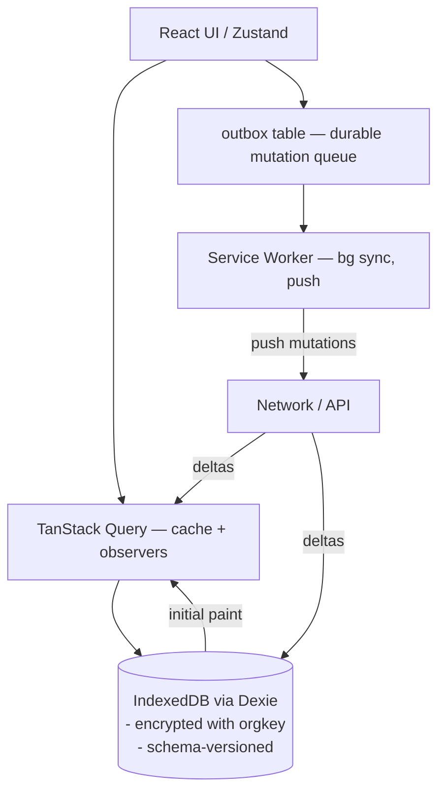
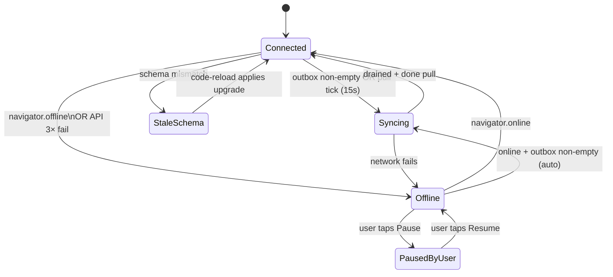

# 04 — Offline-First & Sync

**Owns:** the offline architecture end-to-end — local store, mutation queue, sync engine,
conflict policy, service worker, push/pull protocol, UI states. Critical-write offline
scope (per requirement): trips create/dispatch/start/checkpoint/complete, fuel logs,
e-POD, pre-trip inspection, maintenance notes — all usable with zero connectivity. Read
caching is universal across the whole app. Companion docs: `03` for the wire protocol,
`08` for offline UX states, `06` for rules-engine samples the sync engine reuses.

---

## 1. Goals & Guarantees

| Guarantee | How we provide it |
|---|---|
| App loads & navigates with no network | HTML shell + JS bundles precached; first-view data from IndexedDB; UI compiles shell before any network request |
| Driver on a trip can perform every trip mutation offline | Mutations write to `outbox` + Dexie tables; UI optimistically updates; background sync replays |
| Reads show user's own recent edits while offline | Optimistic writes land in the same Dexie tables reads query from — so UI is consistent with itself |
| Server is the source of truth | Replays validate server-side; the server can reject; client shows a resolution UI for rejected mutations |
| Auto-sync on reconnect | Service Worker `sync` event + foreground `online` listener flush the outbox |
| Manual sync / pause | Top-bar pill with three states: Connected/Syncing/Offline; tap exposes Pause/Resume + Sync-now |
| No data loss | Outbox is durable (IndexedDB); acknowledgements only on successful server commit |
| No double-application | Server is idempotent via `Idempotency-Key` (one per mutation) |

### 1.1 Non-goals (deliberately)
- Offline schema migrations of server tables (we use a generation-stamped local schema, see
  §5; conflicts are managed by version-pin).
- Offline admin features (audit log, settings) — read-only cache, mutations require network.
- Multi-account offline (each browser profile = one user; switching users flushes the cache).

## 2. Critical-Write Scope (user-confirmed)

| Domain | Mutation | Offline? | Notes |
|---|---|---|---|
| Trips | create draft | ✅ | Mutable until dispatch |
| Trips | dispatch | ⚠️ | Allowed only if Smart-Dispatch killed previously (cached rules); server revalidates |
| Trips | start en-route | ✅ | Driver action |
| Trips | checkpoint (position) | ✅ | Geolocation captured; queued |
| Trips | complete | ✅ | Requires odometer + fuel + final location |
| Trips | cancel | ✅ | Driver or manager |
| Pre-trip | submit inspection | ✅ | Required before dispatch; offline queue |
| e-POD | attach photo+signature | ✅ | Photos cached as Blob, uploaded during sync |
| Fuel logs | create | ✅ | Triggers anomaly detection **on sync** (server-side) — client queues and shows pending state |
| Expenses | create | ✅ | Driver-incurred reads later reconcile |
| Maintenance | create note / close | ✅ | Closes out a vehicle flip via replay |
| Vehicles, Drivers, Users, Audit, Settings | mutations | ❌ | Network required; cached read-only |
| Reports | all read-only cached snapshots | cache only | |

## 3. Layered Storage



### 3.1 Dexie schema (per-org keyopaced DB)
Dexie creates one DB per logged-in user (`transitops_<userId>`). Encryption via
`dexie-encrypted` (or `fake-indexeddb` in tests) using a per-org data key derived from the
user's session handshake (`deriveKey(refreshTokenHash, salt)`). On logout, the DB is wiped.

#### Tables (`db.version(N).stores({...})`)
```
vehicles         "id, status, type, updated_at"
drivers          "id, status, license_expiry_date"
trips            "id, status, vehicle_id, driver_id, dispatched_at, updated_at, client_updated_at"
trip_events      "id, trip_id, recorded_at"
fuel_logs        "id, vehicle_id, filled_at, client_updated_at"
expenses         "id, vehicle_id, incurred_at"
maintenance_logs "id, vehicle_id, status"
e_pod_records    "id, trip_id"
pre_trip_inspections "id, trip_id"
notifications    "id, created_at, read_at"
outbox           "++seq, idempotency_key, type, status, attempts, next_attempt_at"
sync_cursor      "key"                     // single row: {last_pulled_at, last_server_stamp}
metadata         "key"                     // single row schema_version, last_known_user_id
blobs            "id, kind, ref_id"        // e-POD photos, signatures, documents pending upload
```
`client_updated_at` is the local timestamp the row was last touched — used to detect stale
reads vs. optimistic writes during sync.

## 4. Mutations vs Reads — patterns

### 4.1 Reads
Every TanStack Query key is paired with a Dexie read on miss. Pattern:
```ts
useQuery(['vehicles', filters], async () => {
  // 1) Read Dexie first (synchronously) — Dexie Promise resolves fast; cache them via
  //    TanStack's `initialData` or a placeholderData helper
  // 2) Fetch /api/v1/vehicles; on success, Dexie.bulkUpsert() the page
  // 3) If fetch fails with network → return the Dexie result (status='offline-cache')
})
```
The hook wires an `isStale` flag when `last_synced_at` is older than the per-resource TTL
(vehicles 60s, trips 15s, fuel_logs 5m, notifications 30s).

### 4.2 Mutations
```ts
mutateOffline({
  type: 'trip.complete',
  id: tripId,
  idempotency_key: uuid4(),
  payload: { ... },
  apply: (tx) => tx.table('trips').update(tripId, { status: 'completed', client_updated_at: now() })
})
```
The helper:
1. Opens a Dexie transaction; applies the local mutation atomically with inserting into
   `outbox`.
2. Returns success to the UI (the local optimistic update).
3. Calls the sync pump (`enqueueSync()`), which:
   - If `navigator.onLine` → POST `/sync/push` immediately.
   - Else → registers a background sync via the Service Worker (`sw.sync.register('flush-outbox')`).

### 4.3 Optimistic but cancelable
Each mutation stores an `apply()` and `revert()` closure (or `apply_json` for replay). If
the user triggers a manual rollback before sync, the change is reverted from Dexie and the
outbox entry is removed (`status: 'cancelled'`). Once synced, it cannot be rolled back;
subsequent changes go through new mutations.

## 5. Local Schema Versioning

Local Dexie schema is `schema_version: "YYYYMMDD.<n>"`, verified against the server on boot.
- `/sync/info` returns `min_client_schema` and `server_schema`.
- If local < `min_client_schema`: app refuses to allow mutations and shows banner
  "Update required to capture changes offline". Reads continue.
- If local < `server_schema`: read paths tolerate missing fields (default values); client
  schedules a refresh-and-upgrade on next idle; bulks update Dexie shape via Dexie's
  `db.version(n+1).upgrade(tx => ...)`.

## 6. The Outbox

### 6.1 Row shape
```ts
type OutboxEntry = {
  seq: number                  // autoincrement; ordering key for replays
  idempotency_key: string      // uuid v4 — also sent to server (see 03 §7)
  type: string                 // 'trip.complete', 'fuel_log.create', ...
  entity_id: string            // target id (existing or client-assigned for creates)
  payload: unknown             // immutable after insert
  apply_json: unknown | null   // for rerun after local restore
  status: 'pending' | 'in_flight' | 'acked' | 'failed' | 'cancelled'
  attempts: number
  max_attempts: number         // 5 by default, 12 for photo uploads
  next_attempt_at: number      // ms epoch
  last_error: { code: string; message: string; retryable: boolean } | null
  created_at: string
  updated_at: string
}
```

### 6.2 Ordering & partial ordering
- Replays go strictly in `seq` order per client.
- Some mutations are commutative (a position checkpoint and a fuel log on the same trip are
  independent); the server makes them idempotent — order is preserved for predictability.
- Two writes to the same entity preserve order; the later one carries a newer
  `client_updated_at` and the server refuses ones that arrive "after a newer server stamp"
  (compare server's `server_stamp`) → outbox marks it `failed` with `OFFLINE_REPLAY_REJECTED`
  and the user resolves via the conflict UI.

## 7. Server-Side Sync Protocol

### 7.1 Push (`POST /sync/push`)
Request:
```jsonc
{
  "client_id": "device-uuid",
  "client_seq": 47,
  "mutations": [
    { "idempotency_key": "6f8a...", "type": "trip.complete",
      "entity_id": "0b1...", "payload": { ... }, "occurred_at": "..." }
  ]
}
```
Response returns per-mutation status:
```jsonc
{
  "results": [
    { "idempotency_key": "6f8a...", "status": "applied",
      "entity": { "type": "trip", "id": "0b1...", "etag": "W/\"...\"", "updated_at": "..." } },
    { "idempotency_key": "b22c...", "status": "rejected",
      "error": { "code": "BUSINESS_RULE_VIOLATION", "message": "...", "details": [...] } },
    { "idempotency_key": "9de1...", "status": "replayed",
      "entity": { ... } }
  ],
  "server_clock": "2026-07-12T10:11:12Z",
  "next_cursor": "01HN..."
}
```
- `applied`: outbox marks `acked`; client pulls the entity's authoritative representation.
- `rejected`: outbox marks `failed`; mutation is NOT auto-retried (see §9).
- `replayed`: server saw this idempotency key already → resends its original result. No
  duplicate side effects.

The push is transactional per idempotency key but **not** across keys: if 5 keys land on the
server and 3 fail, those 3 are returned failed and the other 2 are persisted.

### 7.2 Pull (`POST /sync/pull`)
```
POST /sync/pull
{ "since": "2026-07-12T09:00:00Z", "entity_types": ["trips","vehicles", ...], "cursor": "..." }
```
Returns changes the caller is authorized to see (RBAC enforced server-side) since the cursor:
```jsonc
{ "deltas": [ {"type":"upsert","entity":"trip","id":"0b1...","data": {...}, "etag":"...",
                 "server_stamp":"2026-07-12T09:11:00Z", "deleted": false },
               {"type":"delete","entity":"vehicle","id":"v1", "deleted": true} ],
  "next_cursor": "...",
  "server_clock": "...",
  "has_more": false }
```
The client walks `deltas` in order; for each entity the client merges into Dexie, replacing
fields that the client does NOT have dirty (matching `client_updated_at < server_stamp`).
See §8 for full merge rules.

## 8. Conflict Policy (server-authoritative + replay queue)

The merge algorithm resolves conflicts deterministically on the **client** after each pull
delta arrives, while the server is the ultimate arbiter for accepted values.

### 8.1 For each pulled delta on an existing local row
- If local `client_updated_at` is null (no dirty offline edit) → apply the server value
  directly.
- Else if local `client_updated_at > server_stamp` (still a pending offline edit) → keep
  local; the outbox entry will be synced and the *server* decides (it will accept if its
  newer state still satisfies invariants, else reject).
- Else (local `client_updated_at <= server_stamp`) → server value wins field-wise; preserve
  any dirty fields whose `client_updated_at` is newer than the field's own last pull
  timestamp. To keep this tractable we track per-field stamps in `*_stamps` columns in
  Dexie for the most-conflict-prone entities (trips, fuel_logs only for v1).

### 8.2 For each rejected outbox entry (server-authoritative)
1. Mutations that fail with `OFFLINE_REPLAY_REJECTED` or `BUSINESS_RULE_VIOLATION` go to a
   user-visible **Sync Issues** tray (bell → "Sync Issues").
2. The user sees: original action, server's reason with localized code, and options:
   - **Re-fetch & overwrite my edit** → cancels local dirty state, pulls fresh, applies.
   - **Discard my edit** → outbox entry moves to `cancelled`, local row is set to last-known
     server value, removes optimistic state.
   - **Keep waiting** → leaves as failed, will resume attempts when the user re-syncs.
3. Per-entity fields that are *not* in conflict (e.g. adding a checkpoint vs. closing the trip
   by another manager) are preserved per-field.

### 8.3 For each `replayed` result → marks outbox `acked` for that key.

### 8.4 Hard server deletes during offline edit
- If the server reports a delete of a row the client has dirty offline edits for, the
  conflict UI surfaces "deleted on server; you have local changes — discard or keep as
  local draft (will fail)".

## 9. Photos & Signatures (e-POD, inspection, documents)

Blobs go to the `blobs` Dexie table (Blob objects) keyed by `(kind, ref_id, part)`. The
mutation outbox **separates metadata upload from blob upload**:
1. Sync engine first replays the metadata mutation (`trip.pod.attach`).
2. The server returns the upload URL (`PUT` to S3 pre-signed).
3. Sync engine uploads blobs to the signed URL.
4. On confirmation, marks the outbox row `acked` and the entity's `pod_storage_key`.

Photo uploads have their own outbox field `blob_pending=true`; until they upload, the e-POD
exists locally only and is shown with a "Uploading…" banner. Next-attempt retry is generous
(up to 12 attempts with 2× backoff).

> This is the one place where the **client holds data the server does not yet have**. The
> UI never claims the POD is delivered until the blob is uploaded and metadata is `acked`.

## 10. Sync Engine Lifecycle



Sync tick (online, idle): pull every 15s; push whenever outbox non-empty. Each tick:
1. POST `/sync/push` with current batch (max 50 mutations / 256KB).
2. Process results → ack/reject.
3. POST `/sync/pull` with current cursor → process deltas.
4. Advance `sync_cursor.last_pulled_at` to `next_cursor`.
5. WebSocket delivers real-time deltas *between* ticks (primary path) — pulls are the catch-up.

### 10.1 Backoff & quotas
- Network failures: 1s → 2 → 4 → 8 → 16 → 60s cap.
- After 5 consecutive failures → engine enters `Offline` mode (no retries until online
  event or manual).
- Server `429 Rate Limited`: respect `RateLimit-Reset`.
- Outbox entries with `max_attempts` exceeded → `failed` for user resolution.

### 10.2 Pause / Resume
User can pause sync (stops both push and pull). The outbox keeps accumulating; data does not
get lost. Resume catches up. Pause is per-session; not persisted across reboots (a fresh
session always starts Connected unless the network is actually down).

### 10.3 Manual Sync Now
User can tap "Sync now" — flushes outbox and pulls a fresh delta immediately, even while
`Paused`.

## 11. UI States

These are owned at the top-bar pill — see `08-UI-UX-Design-System.md` §Offline states for
visual spec.

| State | Pill | Behavior |
|---|---|---|
| Connected | green dot "Synced" | Sync tick silent |
| Syncing | spinner "Syncing …" | Outbox drain + pull |
| Offline | amber "Offline · 3 pending" | Reads from cache; ticks paused; mutations buffered |
| Issues | red "Sync issues" pivot to tray | Toast actionable click → tray |
| Stale schema | magenta "Update app" banner | Reads-only; no mutations |

Toast on each state change (except Connected→Syncing) for one second only — never nagging.

## 12. Service Worker

- Precache the app shell on `install`; activate aggressively; clean old caches on `activate`.
- Runtime caching strategies:
  | Pattern | Strategy |
  |---|---|
  | App HTML/JS/CSS (hashed assets) | `CacheFirst` (immutable, hashed url) |
  | Fonts, icons | `StaleWhileRevalidate` |
  | API GET | `NetworkFirst` with 3s timeout → cache fallback (keeps API cache for offline reads) |
  | API POST (any mutation) | **Never cached**, never shimmed — failures bubble up to the React layer so the outbox can capture |
  | Maps tiles (OSM) | `StaleWhileRevalidate`, max 200MB LRU cache |
- Background Sync plugin (`workbox-background-sync`) is **not used** for mutations because
  we own ordering/idempotency in our own outbox; the SW exposes a `message` channel so the
  page can call `sw.sync.register('flush-outbox')`.
- Push notifications (`07`) handled in the SW: shows notification; on click focuses the
  already-open tab if present.

## 13. Auth & Token Lifecycle Across Offline

- Access tokens expire while offline; the page queues mutations in the outbox regardless.
- On `online` or next push attempt, the sync engine first refreshes the access token using
  the refresh token (which has a 30-day lifetime and rotating family — see `10`). If refresh
  fails: signal logout; preserve the outbox on disk but **do not allow new mutations** until
  the user logs in again (the existing entries are encrypted to the previous session key
  and become unreadable on a new session — they're discarded with a one-time warning).

### 13.1 The "low battery / lost GPS" coupling
Driver mutations that need GPS (start, checkpoint, complete) include `permit_no_gps: true`
for *up to the first 30 minutes* of a trip segment if no fix is available; the user may
authorize manual location entry. Without that override, the relevant action's button is
disabled with inline reasoning. See `09` Driver workflow.

## 14. Telemetry of Sync (for the dev/QA surface)

- A dev-only "Sync Inspector" page lists the outbox table with live updates.
- Each row's transition (`pending → in_flight → acked | failed`) emits a Pino log line
  with `trace_id` propagated from the originating UI action (the React mutation passes one).
- On prod, sync metrics exported to Prometheus: outbox depth, oldest entry age, push
  success rate, rejection rate by code.

## 15. Acceptance

The offline-first contract is satisfied when:
1. Driver can complete a simulated 3-hour delivery round with the device in airplane mode
   — pre-trip inspection, start, checkpoints, e-POD, complete — and on reconnect the
   server has all records within 30s including uploaded photos.
2. Two competing completes (same trip from two devices, one offline) cause one to succeed
   and the other to surface a Sync Issue with clear cause-and-options UI.
3. The app boots and shows real (cached) fleet data within 500ms while offline — never a
   blank screen.
4. Outbox survives a hard refresh + browser restart; queued mutations replay on next launch.
5. The remote PWA install (`Add to Home Screen`) launches without network and lands directly
   on the user's last-viewed screen.
6. Optimistic reads never go *backwards* in time when a server delta arrives (timestamps
   guarantee monotonic progression of `updated_at` for accepted values).