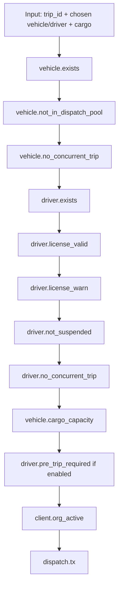

# 05 — Business Rules & Validation

**Owns:** every business rule that governs state transitions and invariants, the
server-side validation chain, the dispatch kill-switch contract, the manual-override
contract, and the rule-visualization protocol the UI consumes. Companion docs: `02`
(columns/constraints), `03` (error envelope), `06` (intelligence that *uses* the same
rules), `09` (UX that *renders* the same rules).

> **Architectural rule:** rules are pure functions in `modules/<domain>/rules.ts`. They are
> trivially unit-testable, called identically by the service layer (server-authoritative)
> and the dispatch-recommendation Smart-Dispatch UI (client-side preview only). The client
> is *noisy*; the server is *decisive*.

---

## 1. The Rule Taxonomy

A **rule** is one of three kinds:

| Kind | Example | Enforced at | Failure returns |
|---|---|---|---|
| **Invariant** | Registration number unique; cargo ≤ max_capacity; cost ≥ 0 | DB constraint + server DTO | `VALIDATION_FAILED` (422) — caught + mapped |
| **Transition guard** | Vehicle must be `available` to dispatch; driver license must not be expired | `rules.<action>.validate()` returning a chain of `RuleResult` | `BUSINESS_RULE_VIOLATION` (422) with details |
| **Side-effect contract** | Dispatching a trip flips vehicle+driver to `on-trip`; closing maintenance restores available | Service layer within a DB transaction, after guards pass | Wrap in tx; rollback on any failure |

### 1.1 RuleResult
```ts
type RuleResult = {
  rule: string                 // e.g. 'vehicle.available'
  ok: boolean
  reason?: string              // machine key, e.g. 'vehicle.in_shop'
  message: string              // human (en, localized client-side)
  field?: string               // for the UI's field-level error indicator
  severity?: 'block' | 'warn'  // 'warn' allows manual override (see §10)
  metadata?: Record<string, unknown>  // e.g. remaining_capacity, expires_in_days
}
```
The dispatch return shape is `RuleChain = RuleResult[]`. The chain order is *fixed* per the
display below; the server appends `dispatch.allowed` only when all `block` results are `ok`.

### 1.2 Where rules run
- **Server** — service layer is the only authoritative run. Never trust UI chains.
- **Client** — `useDispatchCheck()` TanStack Query mirrors the server chain by calling
  `POST /intelligence/dispatch-check` (validated server-side). Used for the live
  Business-Rules Visualization (blueprint §7.12). Pure-function preview is also exported
  from the same `rules.ts` for instant local feedback; mismatch with server (e.g. score
  changed between keystrokes) resolves in the server's favor on submit.

## 2. Mandatory Rules Catalog (blueprint §6 expanded)

Each rule below has: ID, statement, kind, contract, message key, metadata.

### 2.1 Vehicle rules
| ID | Statement | Kind | Detail |
|---|---|---|---|
| `vehicle.reg_unique` | Registration number unique within org | Invariant | DB CHECK `unique(org, reg)`; messages `vehicle.reg_unique.duplicate` |
| `vehicle.not_in_dispatch_pool` | Retired or in-shop vehicles excluded from dispatch selection | Transition guard | Filter applied in `dispatchPool()` read; **never** `select available?` for the picker |
| `vehicle.no_concurrent_trip` | A vehicle currently `on-trip` cannot be assigned to another trip | Transition guard | Combined with `driver.no_concurrent_trip` |
| `vehicle.cargo_capacity` | Cargo weight must not exceed the assigned vehicle's max_load_capacity | Transition guard | metadata `{ max_capacity_kg, cargo_kg }` |
| `vehicle.odometer_monotonic` | A new odometer value cannot be lower than the last | Transition guard | Applies to all `odometer_km` updates (trip complete, fuel log, maintenance) |
| `vehicle.status_in_shop_on_maintenance_create` | Creating an active maintenance record flips vehicle to `in-shop` | Side-effect contract | Runs inside maintenance-create tx |
| `vehicle.status_available_on_maintenance_close` | Closing maintenance restores vehicle to `available` **unless retired** | Side-effect contract | Pre-check `vehicles.status != 'retired'` |
| `vehicle.status_on_trip_on_dispatch` | Dispatch flips vehicle to `on-trip` | Side-effect contract | Inside trip-dispatch tx |
| `vehicle.status_available_on_complete` | Trip completion flips vehicle back to `available` | Side-effect contract | Inside trip-complete tx |
| `vehicle.status_available_on_cancel` | Dispatched trip cancellation restores vehicle to `available` | Side-effect contract | Trip must be `dispatched` or `in-transit`; client must cancel `draft` trips separately |
| `vehicle.retire_blocks_dispatch` | `retired` vehicles never enter dispatch pool | Transition guard | |

### 2.2 Driver rules
| ID | Statement | Kind | Detail |
|---|---|---|---|
| `driver.license_valid` | Driver license not expired at dispatch time | Transition guard | Use **planned_departure_at** if set; else `now()`; metadata `{ expires_on, days_remaining }` |
| `driver.license_warn` | Warn if license expires within `license.expire_warn_days` (default 30) | Transition guard (warn) | Severity `warn`; manual override allowed but recorded |
| `driver.not_suspended` | Driver status ≠ `suspended` at dispatch | Transition guard | Hard block |
| `driver.no_concurrent_trip` | A driver `on-trip` cannot be assigned another trip | Transition guard | |
| `driver.status_on_trip_on_dispatch` | Dispatch flips driver to `on-trip` | Side-effect contract | Inside tx |
| `driver.status_available_on_complete` | Trip complete flips driver back to `available` unless `off-duty` was set during trip | Side-effect contract | Off-duty reversion is configurable per-org |
| `driver.status_available_on_cancel` | Cancelling a dispatched trip restores driver to `available` | Side-effect contract | |
| `driver.pre_trip_required` | A trip must have a passing pre-trip inspection before dispatch (innovation, `09`) | Transition guard | Configurable per-org |

### 2.3 Trip rules
| ID | Statement | Kind | Detail |
|---|---|---|---|
| `trip.draft_mutable` | `draft` trips can be edited freely | Transition guard | After dispatch, only supplier/metadata fields editable |
| `trip.dispatch_requires_vehicle_driver` | Dispatch requires both vehicle + driver | Transition guard | Drafts can be created with neither |
| `trip.complete_requires_odometer` | Completion requires `actual_distance_km` + `fuel_consumed_l` (or signed manual entry) | Transition guard | Driver can supply; reconciliation job revalidates |
| `trip.transition_only_forward` | Lifecycle `draft→dispatched→in-transit→completed` (or `→cancelled` from `draft` or `dispatched`) | Transition guard | No backward transition (created-completed not allowed) |
| `trip.cancel_reason_required` | Cancelling requires a reason from a controlled vocabulary | Transition guard | `reason ∈ {customer, vehicle_breakdown, weather, compliance, duplicate, other}` |

### 2.4 Maintenance & anomaly rules
| ID | Statement | Kind | Detail |
|---|---|---|---|
| `maintenance.create_flips_in_shop` | Creating active maintenance sets vehicle to `in-shop` | Side-effect | |
| `maintenance.close_restores_available` | Closing maintenance restores the vehicle to `available` (unless retired) | Side-effect | |
| `maintenance.predicted_due` | When `odometer_since_last_service` ≥ threshold → `MaintenanceSchedule.status='pending'` w/ `predicted_due_odometer` | Computed | Subscription to `trip.completed` + `maintenance.closed` |
| `fuel.anomaly_detection` | When actual KPL deviates >`fuel.anomaly_deviation_pct` from rolling EWMA → `FuelAnomalyFlag` written | Computed | Subscription to `fuel.log.created` |

### 2.5 Finance & reporting rules
| ID | Statement | Kind | Detail |
|---|---|---|---|
| `finance.cost_non_negative` | All monetary amounts ≥ 0 | Invariant | Server-side + DB check |
| `finance.cost_decimal_scale` | Money ≤ 14,2 | Invariant | Truncate, not round |
| `finance.odometer_non_negative` | km values ≥ 0 | Invariant | |
| `finance.units_metric_storage` | All distances in km, fuel in litres, weights in kg | Invariant | Conversion only at the UI layer |
| `finance.period_closed` | Some periods (via `settings.finance.closed_periods`) reject retro-edits | Transition guard | Optional per-org; off by default |

### 2.6 Cross-cutting audit rules (always-on)
| ID | Statement | Kind |
|---|---|---|
| `audit.every_transition` | Every state change writes one `audit_log` row with old/new values | Side-effect via event subscriber |
| `audit.every_crud` | Every create/update/delete on master data writes an audit row | Side-effect |
| `audit.read_history_admin_only` | `GET /audit-logs` is admin-only | Auth guard |

## 3. The Dispatch Validation Chain (canonical ordering)

This ordering is **the order the UI renders** the Business-Rules Visualization and **the
order the server evaluates** the rules. A `block` failure short-circuits the chain: later
rules are still computed for display (so the manager sees *all* problems, not just the
first), but the dispatch is rejected and no side effects run.



### 3.1 Wire result (`POST /intelligence/dispatch-check`)
```jsonc
{
  "data": {
    "chain": [
      { "rule": "vehicle.exists",       "ok": true },
      { "rule": "vehicle.not_in_dispatch_pool","ok": true },
      { "rule": "vehicle.no_concurrent_trip", "ok": true },
      { "rule": "driver.exists",        "ok": true },
      { "rule": "driver.license_valid", "ok": false, "reason": "driver.license_expired",
        "field": "driver_id", "message": "Driver license expired on 2025-11-04",
        "severity": "block", "metadata": { "expires_on": "2025-11-04", "days_remaining": -250 } },
      { "rule": "driver.license_warn",  "ok": true },
      { "rule": "driver.not_suspended", "ok": true },
      { "rule": "driver.no_concurrent_trip","ok": true },
      { "rule": "vehicle.cargo_capacity","ok": true,
        "metadata": { "max_capacity_kg": 12000, "cargo_kg": 5500 } },
      { "rule": "driver.pre_trip_required","ok": true }
    ],
    "canDispatch": false,
    "blocking_reason": "driver.license_expired"
  }
}
```
The `Dispatch` button in the UI binds `disabled = !canDispatch`; the inline reason shows the
localized text of the first failed `block` rule.

## 4. Manual Override (the "I accept the risk" path)

Some rules are `warn` (license expiring soon) or otherwise `block`-but-overridable per
policy decision (over-capacity with documented tolerance), see `settings.dispatch.overrides`.

- Override requires `force=true` in the POST body and a typed `override_reason` from a
  closed vocabulary.
- The server **re-runs** the chain. `warn` failing rules become `ok=true` if `force=true`
  *and* `override_reason` matches; `block` rules ignore force (cannot be overridden).
- Every override writes a `audit_logs.action='trip.dispatch.override'` with the rules it
  bypassed in `old_value`/`new_value`. Override abuse shows in a compliance report (`11`).
- The UI shows the override checkbox only when *all remaining failures are warn-severity*
  - never tease an override the server will refuse.

## 5. DTO + Zod Boundary

A Zod schema guards the request boundary before any rule runs.

```ts
// modules/trips/dto.ts
export const dispatchTripInput = z.object({
  force: z.boolean().default(false),
  override_reason: z.enum(['customer','capacity_tolerance','license_warn']).optional()
});
export type DispatchTripInput = z.infer<typeof dispatchTripInput>;

export const createTripInput = z.object({
  source_label: z.string().min(1).max(200),
  source_lat: z.number().min(-90).max(90).optional(),
  source_lng: z.number().min(-180).max(180).optional(),
  destination_label: z.string().min(1).max(200),
  destination_lat: z.number().min(-90).max(90).optional(),
  destination_lng: z.number().min(-180).max(180).optional(),
  cargo_weight_kg: z.number().positive().max(100000),
  planned_distance_km: z.number().positive().max(20000).optional(),
  planned_departure_at: z.string().datetime().optional(),
  customer_id: z.string().uuid().optional(),
  vehicle_id: z.string().uuid().optional(),
  driver_id: z.string().uuid().optional()
});
```

The same schema is reused client-side (form library). Failure produces
`VALIDATION_FAILED` with `details[].field` set per Zod path. DTOs never include derived
fields or computed values (those go in response serializers).

## 6. Server-Side Sanitization

- All string inputs are trimmed and length-capped by the matching Zod schema.
- HTML is escaped at the storage boundary for any field that may render in the UI as text
  (descriptions, notes). Stored as escaped text; rendered via React (no `dangerouslySet`).
- Numeric fields: coerce strings to numbers via Zod's `coerce`, refuse `NaN`/`Infinity`.
- Datetimes: parse via `z.string().datetime()` (ISO-8601 UTC only); reject anything that
  fails to round-trip.
- Arrays: enforce max length (e.g., document uploads ≤ 10/trip).
- Reject unknown keys (`z.object(...).strict()`) so clients can't smuggle fields.

## 7. Transactional Side-Effect Boundaries

The dispatch chain must atomically: insert the trip event, update vehicle + driver, write
audit log table (via subscriber normally, but the side-effect is in the same DB tx for
'server-as-truth' guarantee; the audit_log insert is performed directly inside the tx, not
via the async subscriber path, because the event is published only on commit).

```sql
-- pseudocode tx for dispatch
BEGIN;
SELECT * FROM vehicles WHERE id = $1 FOR UPDATE;        -- lock the row
SELECT * FROM drivers  WHERE id = $2 FOR UPDATE;
INSERT INTO trips (...) VALUES (...) ON CONFLICT DO NOTHING;
UPDATE vehicles SET status='on-trip', updated_at=now() WHERE id=$1;
UPDATE drivers  SET status='on-trip', updated_at=now() WHERE id=$2;
INSERT INTO audit_logs (action, entity_type, entity_id, old_value, new_value, occurred_at, actor_id, trace_id)
  VALUES ('trip.dispatch', 'trip', $tripId, $oldTrip, $newTrip, now(), $actor, $trace);
INSERT INTO trip_events (trip_id, event_type, recorded_by, recorded_at)
  VALUES ($tripId, 'dispatched', $actor, now());
-- publish('trip.dispatched', ...) AFTER commit (out of band)
COMMIT;
```

> Critical: every state-changing side-effect must occur **inside the same transaction** as
> the mutation, while the **event publish** happens after commit. This way failure rolls
> everything back, success guarantees audit + side effects are durable, and async workers
> never see half-applied state.

## 8. Rule Concurrency (two managers, same vehicle)

- `SELECT … FOR UPDATE` serializes competing dispatches on the same vehicle/driver.
- The second arrives; `vehicle.no_concurrent_trip` now returns `false` because the first
  already committed → second dispatch rejected with `BUSINESS_RULE_VIOLATION`.
- The client UI shows the rejection with the new state of the vehicle so the manager can
  re-fetch and pick a different vehicle.

## 9. Rule Tests (mandatory)

- Each `rules.ts` rule has parameterized unit tests covering happy + at least three failure
  variants. Generated truth table test cases live beside the rules.
- The dispatch chain has an integration test that:
  - Spins Postgres via testcontainers.
  - Drives a real trip through `draft → dispatched → in-transit → completed`.
  - Verifies every side effect (vehicle/driver flip, audit row, event published,
    MaintenanceSchedule updated if odometer crossed threshold).
- Property-based tests verify invariants over random inputs (e.g. cargo > capacity always
  rejected, regardless of fuzzed fields).

## 10. Notifications Triggered by Rules

See `07-Notifications-Alerts.md` for the notification *audience/channel* edge cases. This
doc only defines **which rules emit a notification request event**:

- `driver.license_warn` → `notification.requested` payload includes driver id + expiry
  date; audience role `safety_officer` + the driver's user (if any).
- `maintenance.predicted_due` → cargo audience `fleet_manager`.
- `fuel.anomaly_detection` → audience `financial_analyst` + the assigned driver (if any).
- Any `BUSINESS_RULE_VIOLATION` → no notification; the failure is the UX feedback.

## 11. Acceptance

- All §2 rules have unit tests passing; the dispatch chain test passes against a live PG.
- The client `POST /intelligence/dispatch-check` chain returns the *same decisions* as the
  server's dispatch transaction for any input (no UI escape hatch).
- No transport state machine transition is reachable server-side without going through the
  rule chain (verified by an integration test that calls each endpoint with bypassed UI).
- Every audit row exists for every state change in the test fixture (table-count assertion).
- An attempt by a `driver`-role caller to call `POST /trips/{id}/dispatch` returns 403 —
  the rule chain never even runs. (RBAC lives in `10`; here we restate because dispatch is
  the most regression-prone surface.)