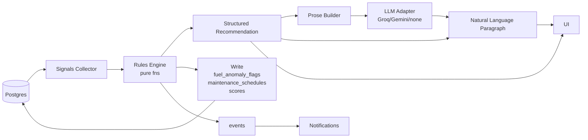

# 06 — AI / Copilot / Intelligence

**Owns:** the Intelligence layer (rules engine, scoring, anomaly detection, predictive
maintenance, recommendations, Copilot prose, Operations Summary) plus the LLM adapter
contract. Companion docs: `05` (rules already used by dispatch), `11` (formulas used by
scoring), `12` (external LLM adapter plumbing), `02` (tables this layer writes), `09`
(screens this layer renders).

> **Decided posture (user-confirmed):** rules always generate the recommendation. If online,
> an LLM re-rites the structured recommendation into natural language. The recommendation
> always shows *why* — the trace of signals + threshold values that produced it. LLM is a
> prose wrapper; never a decision-maker.

---

## 1. Architecture



Three pillars:
1. **Rules Engine** — pure functions producing structured recommendations and computed
   side-table writes (anomaly flags, schedules, scores). Deterministic + unit-tested.
2. **Scoring & Anomaly Workers** — event subscribers that materialize scores/anomalies
   into DB (driving Reports + UI).
3. **Prose Builder + LLM Adapter** — turns the structured recommendation into human
   language. Rules build the templated rendering; if LLM is available + flag on + online,
   the LLM rewrites for fluency. Trace is **always** rendered in either case.

## 2. Signals Catalog

Every rule operates on a **SignalsView** — a frozen snapshot of inputs for a specific
target (vehicle / driver / trip / fleet). Composed by `lib/intelligence/signals.ts` from a
small set of typed queries. *Signals are read-replicas — never queried inline in the rule
function.*

```ts
type VehicleSignals = {
  vehicle_id: string
  organization_id: string
  odometer_km: number
  status: 'available'|'on-trip'|'in-shop'|'retired'
  fuel_type: string
  // historical
  rolling_kpl: number | null             // EWMA α=0.3, see §3
  latest_kpl: number | null
  recent_trips: TripSummary[]              // last 5
  maintenance_history: MaintenanceSummary[]
  last_service_odometer: number | null
  anomalies_last_30d: AnomalySummary[]
  driver_summary: DriverSummary | null
  utilization_pct: number                  // last 30d
  co2_kg_30d: number
  org_thresholds: OrgThresholds
};
```

Org-wide thresholds come from `settings.payload` (see `02 §9`); the **stored** shape is the
single source. Examples with defaults:

| Threshold | Default | Effect |
|---|---|---|
| `maintenance.oil_change_km_threshold` | 5000 | Predicted service due |
| `maintenance.tyre_rotation_km_threshold` | 10000 | Predicted service due |
| `fuel.anomaly_deviation_pct` | 15 | Anomaly flag threshold |
| `fuel.rolling_alpha` | 0.3 | EWMA weight |
| `fuel.rolling_min_samples` | 5 | Below this, baseline = vehicle-class average |
| `license.expire_warn_days` | 30 | License warn threshold |
| `predictive_eta.max_delta_min` | 10 | ETA recompute threshold to fire ETA-changed notification |
| `scoring.weights.fuel_efficiency` | 0.25 | Vehicle health sub-weight |
| `scoring.weights.maintenance` | 0.20 | |
| `scoring.weights.driver_safety` | 0.25 | |
| `scoring.weights.utilization` | 0.30 | |

> The **rule** is a pure function: `ruleRecommendation(signals, policy) →
> StructuredRecommendation`. The **side-effect worker** decides whether to write a row
> based on whether one already exists (idempotent).

## 3. Fuel Rolling Baseline (EWMA)

For each vehicle, on each new `fuel_log.created` event:
1. Find the previous fuel log for the vehicle in chronological order (by `odometer_km`,
   tie-broken by `filled_at`).
2. Compute `km = new.odometer - prev.odometer`, `kpl = km / new.liters`.
3. Maintain an EWMA in memory (query latest `vehicle_health_signals` row or compute warm):
   `rolling_kpl = α * new_kpl + (1-α) * rolling_kpl_prev`.
4. If fewer than `fuel.rolling_min_samples` historical fills exist, use the vehicle's
   `type`-class default baseline (seeded table `vehicle_class_baselines`; e.g. truck 3.8
   kpl, van 7.5 kpl, ev 6.0 km/kWh-equiv).
5. Anomaly check: if `actual_kpl < rolling_kpl * (1 - thr/100)` → write
   `FuelAnomalyFlag` with `severity` = `>`30% high, `>`20% medium, else low.
6. Always update the persisted rolling baseline plus the `vehicle_health_signals` timeseries
   row even when no anomaly fires (so the dashboard shows the trend).

> Negative anomaly (much *better* than baseline) is recorded as `deviation_pct` < -thr
> but `severity=low` and a note `'unusually good consumption'`. Useful for driver coaching.

## 4. Predictive Maintenance

On `trip.completed`, `fuel.log.created`, `maintenance.closed`:

```ts
function predictMaintenance(s: VehicleSignals): MaintenancePrediction | null {
  const sinceLast = (s.odometer_km ?? 0) - (s.last_service_odometer ?? 0);
  const rules = configuredMaintenanceRules(s.org_thresholds); // [{ type, km_threshold }]
  const due = rules.find(r => sinceLast + safetyHeadroomKm(s, r) >= r.km_threshold);
  // safetyHeadroomKm = avg_daily_km * 3 (predicted trip-days runway)
  if (!due) return null;
  return {
    vehicle_id: s.vehicle_id,
    basis_rule_id: `${due.type}_${due.km_threshold}km`,
    predicted_due_odometer: (s.last_service_odometer ?? 0) + due.km_threshold,
    predicted_due_date: predictPredictedDueDate(s, due),
    reason_code: 'mileage_since_last_service',
    trace: {
      last_service_odometer: s.last_service_odometer,
      current_odometer: s.odometer_km,
      km_since_last_service: sinceLast,
      km_threshold: due.km_threshold,
      avg_daily_km: s.avg_daily_km,
      safety_headroom_km: 3 * s.avg_daily_km
    }
  };
}
```

The worker **upserts** into `maintenance_schedules` (`status='pending'`); when the
predictive date is in less than 7 days, it emits `notification.requested` for the
`fleet_manager` audience.

## 5. Scoring

Scoring is hierarchical and additive — every sub-score is itself a 0–100 with explicit
formula and trace. See `11-Reports-Analytics.md` for the canonical formulas; this doc owns
the storage + computation cadence.

### 5.1 Driver Score (per `driver_score_history` row)
Daily rollup by the scoring worker. Inputs:
- `safety_score`: existing manual + weighted penalty per `late_trips / trips_count` (≤0.1 →
  -0; ≤0.25 → -10; >0.25 → -20).
- `fuel_rating`: z-score of driver's recent trip kpl vs. fleet distribution; mapped to 0-100.
- `overall_score`: weighted mean per settings weights; the `safety_score` dominates by being
  *clamped* to a max of 75 if the driver has any license expiry in the past year.

### 5.2 Vehicle Health Score (per `vehicle_health_scores` row)
```ts
const overall =
    scoring.weights.fuel_efficiency * fuel_efficiency_pct +
    scoring.weights.maintenance * maintenance_pct +
    scoring.weights.driver_safety * driver_safety_pct +
    scoring.weights.utilization * utilization_pct;
```
Subscores each have a trace: e.g. `fuel_efficiency_pct` = `(recent_kpl - worst_class_kpl) /
(best_class_kpl - worst_class_kpl)` clamped 0-100. `maintenance_pct` = 100 * (1 -
`open_issues_normalized`) − `0.5 * days_overdue`. (See `11` for the canonical formulas and
`11 §KPI Definitions` table.)

### 5.3 Computation cadence
- **Realtime events** trigger scoring for the affected entity only (driver_score on
  `trip.completed`; vehicle_health on `trip.completed`, `maintenance.closed`,
  `anomaly.fuel.detected`).
- **Nightly job** recomputes the rolling baseline + cohort z-scores + daily snapshots.
- All scoring writes carry the signals snapshot in `signals` JSONB so the audit + the UI's
  "explain every metric" popups can reconstruct provenance.

## 6. Smart Dispatch Recommendation

Blueprint §7.2. **Server-owned ranking** shared by:
- `POST /intelligence/dispatch-recommendation` (Trip create form preview).
- `POST /intelligence/dispatch-check` (the rule chain; §05).

### 6.1 Algorithm (deterministic)
```ts
function rankCandidates(input: RouteInput, pool: VehiclePool[]): RankedPair[] {
  const eligibleVehicles = pool.filter(v =>
    v.status === 'available' &&
    v.max_load_capacity_kg >= input.cargo_weight_kg
  );
  const eligibleDrivers = await drivers.inOrg()
    .filterStatus(['available'])
    .filter(d => !licenseExpiredAt(d, input.departure_at || new Date()));

  const rows = cross(eligibleVehicles, eligibleDrivers).map(({vehicle, driver}) => ({
    vehicle, driver,
    scores: {
      capacity_headroom: pct((vehicle.max_load_capacity_kg - input.cargo_weight_kg) /
                             Math.max(vehicle.max_load_capacity_kg, 1)),
      distance_to_pickup: distance(v.home_region, input.source),
      fuel_efficiency: f.normalizedKplScore(vehicle),
      maintenance_headroom: f.predictedDueKmRemaining(vehicle) / DUE_REFERENCE_KM,
      driver_safety: d.driver_safety_score,
      driver_fuel_rating: d.fuel_rating
    }
  // weighted sum → final_rank within 0..1
  }));
  rows.forEach(r => r.confidence = round(weightedSum(r.scores, policyWeights) * 100));
  return rows.sort(byConfidenceDesc);
}
```

### 6.2 The recommendation response
```jsonc
{
  "data": {
    "recommendation": {
      "vehicle_id": "v1",  "driver_id": "d1",  "confidence": 94,
      "scores": { ... },                                   // explainability
      "reasons": [
        { "key": "nearest", "ok": true, "weight": 1.0,
          "message": "Vehicle is in the depot region" },
        { "key": "available", "ok": true, "weight": 1.0,
          "message": "Vehicle and driver both available" },
        { "key": "fuel_efficient", "ok": true, "weight": 0.8,
          "message": "Above peer median fuel efficiency +14% vs class" },
        { "key": "maintenance_due_in_km", "ok": true, "weight": 0.6,
          "message": "Maintenance due in 1,200 km — safe runway" }
      ],
      "alternatives": [ { "vehicle_id":"v3", "driver_id":"d2", "confidence": 87, "reasons":[...] } ]
    }
  }
}
```
The UI shows the top candidate with the confidence number + the readable reason chips.
Clicking "show alternatives" exposes the next 4. The user can override the pick — the
subsequent `dispatch-check` re-validates with their choice.

> The recommendation is *advisory*; the kill-switch lives in `dispatch-check` (§05).
> These two are intentionally separate endpoints so a manager can browse candidates without
> committing to a check.

## 7. Fleet Copilot (per-Vehicle Analysis)

Endpoint: `GET /vehicles/{id}/copilot`. Implemented in `modules/vehicles/copilot.ts`.

```ts
function copilotVehicle(vehicleId: string, opts: { llm: boolean }): CopilotResponse {
  const signals = collectSignals(vehicleId);
  const rec = recommendVehicleMaintenancePlan(signals);  // pure
  return {
    structured: rec,
    prose: opts.llm ? buildProseWithLLM(rec) : buildTemplatedProse(rec),
    sources: trace(rec)               // always present
  };
}
```

### 7.1 Output (structured)
```jsonc
{
  "data": {
    "headline": "Truck TN09AB1234",
    "signals": [
      { "key": "utilization_pct", "label": "Utilization",
        "value": 91, "unit": "%", "context":"above fleet average (78%)",
        "score": "good" },
      { "key": "fuel_efficiency_trend",
        "label": "Fuel efficiency",
        "value": "-14", "unit": "%", "context":"last 5 trips",
        "score": "warn" },
      { "key": "maintenance_due_in_km",
        "label": "Maintenance due in",
        "value": 420, "unit": "km", "score": "warn" },
      { "key": "driver_safety",
        "label": "Driver Ravi",
        "value": "38 trips, 0 violations", "score": "good" }
    ],
    "recommendation": {
      "action": "schedule_preventive_maintenance",
      "timing": "this_weekend",
      "why": "Avoid unplanned downtime predicted in 420 km; utilization impact minimized on Sat.",
      "confidence": 86
    },
    "sources": {  // for the "why" trace UI
      "vehicle_health_score_id": "01HN...",
      "maintenance_schedule_id": "01HN...",
      "anomaly_ids": ["01HN..."]
    }
  }
}
```

### 7.2 Prose templates (rules-only path)
Headline → signals listing → recommendation statement. Three rule shapes drive the
template branch (no-op maintenance, maintenance due, anomaly present). All keys live in
`messages/en/copilot.json` so they're translatable.

### 7.3 LLM-enhanced path
- Adapter at `lib/llm/`. Configured `LLM_PROVIDER` (`groq|gemini|none`).
- **Always** post a *narrow* system prompt and a JSON-shaped structured recommendation;
  instruct the model to rewrite the recommendation prose only — never change numbers, never
  invent new facts, output is JSON `{ prose: string }` constrained by a schema.
- Response validated against the schema; on schema violation or timeout → fall back to the
  templated prose.
- Cache key = `copilot:<vehicleId>:<structured_hash>` for 60 min on Redis (Caller passes
  `If-None-Match` via the structured etag if the underlying signals changed). Cache means an
  LLM-powered demo stays calm on the second hit.
- Strict timeout 8s. Network failure → templated path silently; UI shows no error.

### 7.4 Operational guardrails
- LLM never receives PII (driver's name is *not* sent; we use the driver identifier like
  "Driver 4f3a…" and the UI substitutes the real name afterwards from local data).
- LLM cannot recommend actions the rule engine did not generate (we **ignore** any added
  fields; we honor the structured `recommendation.action` value only).
- LLM prose always paired with the structured `recommendation` UI block; the user can always
  expand to see the machine-readable decision.

## 8. Operations Summary ("Generate Today's Report")

Endpoint: `GET /intelligence/todays-report`. The same summarization logic as Copilot but
fleet-scoped. Output shape:

```jsonc
{
  "data": {
    "as_of": "2026-07-12T10:00:00Z",
    "digest": [
      { "key":"trips_completed","value":42, "unit":"trips", "context":"" },
      { "key":"maintenance_requests","value":3 },
      { "key":"overdue_vehicles","value":1, "context":"TN09AB1234" },
      { "key":"fuel_cost_change_pct","value":7, "delta_basis":"vs_prev_day" },
      { "key":"license_expiring","value":2, "context":"within 7d" }
    ],
    "recommendations": [
       { "action": "schedule_maintenance", "vehicle_id":"vXYZ", "when":"this_week" },
       { "action": "rebalance_region", "from":"north","to":"south","reason":"over-utilization" }
    ],
    "prose": "Today: 42 trips completed..."
  }
}
```

The underlying rec builder scans SignalsView:fleet → applies a small "today's anomalies"
rule set. Same LLM prose path (§7.3) for `digest_prose`.

## 9. Natural-Language Dashboard Query (stretch)

> User-confirmed scope: stretch goal only. Specified here so the seams are clean if/when
> provisioned.

- Endpoint: `POST /intelligence/query` body `{ prompt }`.
- Two-stage safety:
  1. **Intent classification** (`prompt → query_id`) — allow-listed intents: which vehicles
     need maintenance this week; fuel by vehicle/region/time; ROI top/bottom N; safety
     re-score; anomalously expensive trips. Out-of-list → respond "I can answer questions
     about fleet maintenance, fuel utilization, costs, and driver safety."
  2. **Query plan** — the intent maps to a server-defined SQL template (parameterized by
     entities extracted from the prompt). **Never** raw SQL from LLM output.
- Output: prose answer + an embedded chart引流 (the structured response the screen renders).
- Audit log every NL query (input + intent + plan + answer ETAG for browser cache).

This is shipped dark behind `flags.nl_query.enabledFor(orgId)`.

## 10. ETA Prediction + Dynamic Re-routing (innovation)

### 10.1 ETA
- Baseline ETA = `planned_departure_at + planned_travel_mins`.
- Live ETA computed by the ETA worker on each new `vehicle-position` frame (every 30-60s for
  active trips) using a Kalman-ish filter:
  - **Remaining distance** from the live polyline to destination (maps adapter routing).
  - **Speed estimate** = EWMA of recent segment speeds (α=0.5).
  - **Traffic factor** if available from the maps adapter (else 1.0).
- On `eta_change` exceeding `predictive_eta.max_delta_min` since the last published ETA → emit
  `trip.eta_changed` event → notification to dispatch manager + visible on map popup.
- Stored in `trip_events (event_type='position')` with `payload={eta_min, distance_remaining_km}`.

### 10.2 Re-routing suggestion
- When ETA slips more than 15% or the live route deviates from polyline by >5 km, the worker
  calls `maps.routes({ from: live_pos, to: destination, alternatives: true })`.
- If an alternative route has ≥10% shorter travel time → emit `route.recommendation`
  notification (audience: dispatch manager + driver), visible in App with a "preview route"
  button. The driver always decides; we only suggest.

## 11. Anomaly Clustering (lightweight statistics)

Beyond per-vehicle anomalies, a weekly job clusters vehicles by z-score of consumption /
idle-time / lateness to surface **cohort** patterns (e.g. "North-region trucks 18% thirstier
than fleet this month — investigate fuel quality or route gradient"). Output stored in
`reports.cohort_anomalies` (added by `11`). No ML model — just z-score buckets.

## 12. Testing Strategy for Intelligence

| Test scope | Strategy |
|---|---|
| Pure rules | Every rule has parameterized inputs; property tests on signals domain |
| Workers | testcontainers PG + Redis; event replay tests idempotency |
| Prose templates | Snapshot tests; golden outputs |
| LLM adapter | Mock the client; assert schema validation triggers fallback on malformed response |
| ETA prediction | Synthetic trajectory fixtures with known good ETA |
| NL query (if/when shipped) | Allow-list tests for each intent + safety injection tests (prompt injection attempt → "intent unclassified" response) |

## 13. Acceptance

- For any given SignalsView, `recommendVehicleMaintenancePlan` returns the same
  StructuredRecommendation every run (determinism).
- LLM call failure or timeout → templated prose rendered without page break; UI never
  displays an error if LLM is unavailable.
- Copilot block on a Vehicle Detail finishes in p95 < 2.5s on cached runs, < 6s on cold runs
  with the LLM adapter.
- "Explain every metric" popup on a Health Score reflects the actual stored `signals` JSONB;
  no synthetic text interpolated from the model.
- Audit log entries for every recommendation rendered in Copilot via the `copilot.viewed`
  analytics event (one row per session, not per render — see analytics doc).