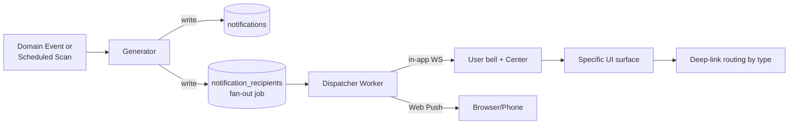

# 07 — Notifications & Alerts

**Owns:** notification lifecycle, audience resolution, channels (in-app + Web/FCM push),
generators (proactive scans + reactive events), priority grammar, idempotency,
escalation, user preferences, and the in-app Notification Center UI contracts. Companion
docs: `02` (notifications + notification_recipients tables), `03` (notification endpoints),
`06` (anomaly generators), `08` (Bell + tray UI), `09` (Notification Center screen).

> **Decided channels:** in-app (web-app bell + WS) **and** Web Push (VAPID); FCM reserved for
> a future native driver app. Email/SMS are explicitly out of scope for v1; the dispatcher
> is shaped so they can be added behind the same interface.

---

## 1. Anatomy of a Notification



A notification is **a single canonical message** (`notifications` row) sent to **one or many
users** (`notification_recipients` rows). The model is "one logical alert → N recipients"
not "N per-user alerts" — this lets the bell badge reflect delivers-per-user, the Center
screen show-group-by-alertId, and the dispatcher dedupe on `notification_fingerprint`.

| Field | Meaning |
|---|---|
| `type` | Machine-readable kind (see §3 enum) |
| `priority` | `red` (urgent) \| `orange` (warning) \| `blue` (info) \| `green` (success) |
| `title` | Localized string key — actual text from `messages/<locale>/notifications.json` |
| `message` | Same |
| `payload` | Deep-link route token + entity refs; drives in-app navigation |
| `audience_role` | If set, fan-out expands to every user with that role in the org; null = broadcast |
| `actor_user_id` | The user whose action created this (null = system) — shown in Center |
| `fingerprint` | Hash of `(type, payload_keys)` — generator uses this to dedupe; e.g. daily license-expiring only creates one row per (driver_id, day) |
| `created_at` | Created on ingest |
| `deleted_at` | Soft delete (admin only) |

Recipients log per-user delivery + read + dismissed + per-channel state, so a notification
can be read in-app but pending push, or in-app sent but push failed.

## 2. Channels & Dispatch

| Channel | Transport | When used | Failure handling |
|---|---|---|---|
| **In-app feed** (Center + bell dropdown) | DB rows + WebSocket `notifications` channel | Every notification | Always-available fallback |
| **Bell badge** | WS frame `{type:'unread-count'}` + REST `/notifications/unread-count` | Every notification | Falls back to 15s poll |
| **Web push** | Web Push API (VAPID) to the user's subscribed endpoints | When `notification_prefs.channels.includes('push')` and a real subscription exists | 3 retries backoff 1→8 min; on `410 Gone` unsubscribe + remove row; on persistent fail mark `push_state='failed'` |

### 2.1 In-app delivery semantics
In-app needs **no delivery worker** — the row appears as soon as the recipient row is
created. The WebSocket fan-out is best-effort; on reconnect the client calls
`GET /notifications?unread=true` for catch-up.

### 2.2 Push registration
- `<ServiceWorkerRegistration>.pushManager.subscribe({ userVisibleOnly: true,
  applicationServerKey: VAPID_PUBLIC })` produces a `PushSubscription` JSON.
- `POST /notifications/register-push` body `{ subscription }` stores per-user, per-org
  (a user can have many active subscriptions — desktop + mobile).
- The endpoint accepts `POST /notifications/unregister-push` to clean up on logout /
  account switch.
- On client unregister (`subscription.unsubscribe()`) the client calls unregister so the
  server doesn't waste pushes on stale endpoints.

### 2.3 Push payload (concise)
Per Web Push size limits (~4KB) we send only `{ event:'notification', id, type, priority,
title, message, payload_route }`. The SW shows a Notification using the title/message and
routes a click handler according to `payload_route`. **Never** include PII in the push
payload (visible on lock screen) — driver names, license numbers, dollar amounts are
substituted at the client.

> Push body template for the SW:
> ```
> { "event":"notification", "id":"01HN…", "type":"license_expiring",
>   "priority":"orange", "title":"notify.license_expiring.title",
>   "message":"notify.license_expiring.body",
>   "context": { "driver_id":"d1" }, // not the name
>   "route": { "path":"/drivers/d1", "tab":"expiry" } }
> ```
> The SW fetches localized strings from the active locale in IndexedDB to render the
> title/message body (so push copy stays localized even when the app is closed).

## 3. Notification Types (canonical enum)

Each type has: id, generator (scheduled or event), audience, priority, payload keys,
deep-link, fingerprint recipe.

| `type` | Trigger | Audience | Priority | Route | Fingerprint |
|---|---|---|---|---|---|
| `license_expiring` | scheduled scan (daily 9am local), `expires within N days` | safety_officer + driver's user if any | orange | `/drivers/{driver_id}?tab=license` | `license_expiring:{driver_id}:{expires_on}` |
| `license_expired` | scheduled scan | safety_officer | red | same | `license_expired:{driver_id}` |
| `maintenance_overdue` | scheduled scan (active maintenance + past due date) | fleet_manager | red | `/vehicles/{vehicle_id}?tab=maintenance` | `maintenance_overdue:{maintenance_id}` |
| `maintenance_predicted_due` | predictive worker | fleet_manager | orange | `/vehicles/{vehicle_id}?tab=maintenance` | `maintenance_predicted:{vehicle_id}:{date}` |
| `trip_dispatched` | event `trip.dispatched` | driver's user + dispatch_manager | blue | `/trips/{trip_id}` | `trip_dispatched:{trip_id}` |
| `trip_completed` | event `trip.completed` | fleet_manager + driver | green | `/trips/{trip_id}` | `trip_completed:{trip_id}` |
| `trip_cancelled` | event `trip.cancelled` | fleet_manager + driver | blue | `/trips/{trip_id}` | `trip_cancelled:{trip_id}` |
| `trip_eta_changed` | ETA worker | dispatch_manager + driver | orange | `/trips/{trip_id}` | `trip_eta_changed:{trip_id}:{eta_bucket}` |
| `fuel_anomaly_detected` | anomaly worker | financial_analyst + driver(if any) | orange | `/vehicles/{vehicle_id}?tab=fuel` | `fuel_anomaly:{flag_id}` |
| `vehicle_unavailable_generic` | rule violations of state | fleet_manager | orange | `/vehicles/{id}` | `vehicle_unavail:{vehicle_id}:{status}` |
| `vehicle_location_stale` | telemetry stall ≥ 5 min for `on-trip` vehicle | fleet_manager | orange | `/vehicles/{id}?tab=map` | `vehicle_stale:{vehicle_id}` |
| `driver_assigned_to_trip` | dispatched event same as `trip_dispatched` (alias) | driver | blue | `/trips/{id}` | `driver_assigned:{driver_id}:{trip_id}` |
| `document_expiring` | scheduled scan (insurance/fitness) | fleet_manager | orange | `/vehicles/{id}?tab=documents` | `document_expiring:{document_id}` |
| `geofence_event` | geofence worker | fleet_manager | orange/blue per `event` | `/vehicles/{id}?tab=geofence` | `geofence:{geofence_id}:{event}` |
| `maintenance_created` | event `maintenance.created` | fleet_manager + safety_officer | blue | `/maintenance/{id}` | `maintenance_created:{id}` |
| `maintenance_closed` | event `maintenance.closed` | fleet_manager | green | `/maintenance/{id}` | `maintenance_closed:{id}` |
| `user_invited` | admin invite | inviter + invitee | blue (no push) | `/settings/users` | `user_invited:{user_id}` |
| `sync_issue` (client-only) | client outbox reject | the acting user only | red | `/sync/issues` | `sync_issue:{outbox_seq}` (virtual — see §9) |
| `system` | broad admin notices | broadcast / all | blue | `/dashboard` | `system:{slug}` |

### 3.1 Adding a new type is a checklist
1. Append to `messages/<locale>/notifications.json` with `<type>.title` and `<type>.body`
   keys taking localized interpolation tokens.
2. Add it to the typed `NotificationType` union in `apps/api/src/lib/notifications/types.ts`
   and the OpenAPI schema.
3. Wire its **generator** (scheduled scan or event subscriber). Generators emit a
   `notification.requested` event (not write directly) — the dispatcher does the write.
   This keeps reordering, dedupe, expansion logic in one place.
4. Specify `audience_role` + `context entity` + `fingerprint`.
5. Add a Center screen renderer entry (icons, colors per §3.2 + §5).
6. Add an e2e test (an event or scheduled scan that produces the row with the right
   audience).

### 3.2 Icon & color contract

| Priority | Color token | Bell dot color | Center card left stripe | Push sound |
|---|---|---|---|---|
| red | `--alert-red` | `var(--alert-red)` | 4px red | default OS urgent |
| orange | `--alert-orange` | `var(--alert-orange)` | 4px orange | default OS |
| blue | `--alert-blue` | `var(--alert-blue)` | 4px blue | soft chord |
| green | `--alert-green` | `var(--alert-green)` | 4px green | none |

Each type also has an **icon** (a fixed Lucide icon name); the icon is independent of
priority so users can scan the Center by category visually.

## 4. Generator Pattern

### 4.1 Event-driven (reactive)
```ts
bus.subscribe('trip.dispatched', async (e) => {
  await requestNotification({
    type: 'trip_dispatched',
    priority: 'blue',
    actor_user_id: e.actor_id,
    organization_id: e.organization_id,
    payload: { trip_id: e.entity.id, driver_id: e.payload.driver_id, vehicle_id: e.payload.vehicle_id },
    audience_resolver: 'driver_and_dispatch_manager',
    audience_role: null,                 // custom resolver used instead
    fingerprint_seed: `trip_dispatched:${e.entity.id}`
  });
});
```
`requestNotification` is idempotent: a unique `(org, fingerprint)` produces one row. The
audience resolver expands referenced entities (e.g. trip → assigned driver → user ↔ driver).

### 4.2 Scheduled (proactive)
Jobs registered in `lib/jobs/registry.ts`:

| Job | Schedule | What |
|---|---|---|
| `LicenseExpiryScan` | daily 09:00 org tz | `drivers WHERE license_expiry_date - today <=N` |
| `MaintenanceOverdueScan` | daily 08:00 org tz | active maintenance where predicted_due_date < today |
| `DocumentExpiryScan` | daily 07:30 org tz | vehicle_documents WHERE expires_on - today <=N |
| `VehicleStaleScan` | every 5 min | vehicles `on-trip` w/ latest location older than 5 min |
| `PredictiveMaintenanceFanout` | hourly | `maintenance_schedules status=pending` + `predicted_due_date <= +7d` |
| `GeofenceEventFanout` | realtime via subscriber | geofence worker emits |
| `DailyDigestEmail` | daily 06:00 (off for v1 by default; ready when email lands) | rolled-up digest for manager |

Each job is **idempotent** (re-running for the same day doesn't duplicate) by virtue of the
fingerprint.

## 5. Audience Resolution

Three audience resolvers — kept explicit:

1. **Role** — write row + fan-out per-count to × users with `(org, role)` where status='active'.
2. **Driver/user pairing** — derivative: when a notification refers to a trip/driver, look
   up the `drivers.user_id` and include them as a per-recipient row labeled
   `audience_kind='subject'`. (Drivers typically operate their own notifications).
3. **Specific user** — direct, no expansion.

Resolution is a **best-effort** operation — if a driver has no linked user, only the
manager gets notified; the driver is still mentioned in `payload.driver_id` so the manager
can act.

### 5.1 Mute, off-hours, and roles
- `notification_prefs.muted_types = ['maintenance_closed', ...]` per user — skip that
  user in the fan-out.
- `notification_prefs.quiet_hours = { from: '22:00', to:'06:00' }` — push held until
  quiet_hours end (with a max 12h delay). In-app still writes immediately.
- Only notifications with `priority in ('red','orange')` punch through quiet hours; `blue`
  + `green` are queued.
- Mute is per-type only — muting all license alerts still allows maintenance alerts.

## 6. Read/Dismiss Semantics

- A notification is **unread** per-recipient while `notification_recipients.read_at is null`.
- "Mark as read" sets `read_at`; "Dismiss" sets `dismissed_at` (further hides it from the
  default list view, but in the full screen rows remain findable).
- "Mark all as read" loops over the user's unread recipients in a single transaction and
  emits one WS `unread-count` delta.
- A row's `dismissed_at` sticks even if the underlying entity re-fires (deduping by
  fingerprint doesn't reset dismissal; new identical alert would have to use a new
  fingerprint seed).

## 7. The Bell + Tray (UI contract)

- Bell icon in the top bar; superimposed unread badge count (capped at 99+).
- On click: dropdown tray (max-height 60vh) lists the 8 most-recent unread by priority then
  recency. Each row: icon + colored left stripe + localized title + relative time + deep-link
  arrow. Click opens the route and marks read.
- Footer: "View all" → `/notifications` Center screen (see `09`).
- The badge updates in realtime via the WS `notifications` channel; on reconnect, REST catch-up.

## 8. Notification Center (full page)

Owned screen in `09`. Spec here is the data contract:
- Filters: priority, type, audience (me vs. broadcast), date range, read/unread.
- Group view groups consecutive rows under the same `notification.id` (the broadcast case)
  with the per-user read/dismiss state.
- Bulk actions: Mark all read; mark selected read; mute type.
- Each row's deep-link chips to the underlying entity (e.g. "Driver Ravi · License expires").

## 9. Sync Issues Tray (offline-specific)

`sync_issue` notifications live in the *client* outbox, not the `notifications` table. They
appear within the same bell tray with a distinctive styling (`--alert-magenta` + wrench icon)
to distinguish server-generated items. Marking resolved does one of the three §8 options in
`04-Offline-First-Sync.md`. They do **not** push (no point pushing the device whose outbox
had the issue).

## 10. Dispatcher Worker

BullMQ job:

| Job | Concurrency | Retries | TTL |
|---|---|---|---|
| `dispatch.inApp` | high (no-op — rows already written) | — | — |
| `dispatch.push` | 4 | 3 (1m,2m,8m exponential) | 5m per attempt |
| `digest.email` | 1 per user | 5 (1h→4h→8h→…) | 24h |
| `digest.sms` | (future) | — | — |

Push dispatch:
1. Fetch user's subscriptions.
2. Encode payload (per §2.3).
3. Sign (VAPID) + send → store `push_state`.
4. Handle the 4xx/410 returned from the push endpoint: prune expired subscriptions,
   dead-letter after final attempt.

## 11. Localization & PII

- Title + body live in `messages/<locale>/notifications.json` keyed by `type.title` /
  `type.body`. Tokens: `{driver_first_name}`, `{vehicle_reg}`, `{delta_pct}`,
  `{remaining_days}`. Tokens are interpolated client-side from `payload`. **Server only
  stores the keys + payload (numbers + ids)** — keeping the org's choice of language able to
  change post-fact without rewriting rows.
- Generic placeholders only — Never include phone, license number, salary, or absolute
  dollar amounts; the Center renders those by looking up the entity client-side (PII rule).

## 12. Audit & Observability

- Each `notifications` row + each `notification_recipients` add-side is auditable (audit
  log only on user-visible writes — creation counts; read/dismiss is user state, not audited).
- Metrics: notifications emitted (by type), push delivery success/failure (per channel),
  unread average (org), top noisy types.
- "Quiet orgs" cap (default 200/hour): if a bug sprays notifications, dispatcher pauses
  writes for the org with `WORK_IN_PROGRESS` and raises a sev-2 alert to ops.

## 13. Acceptance

- Generating a notification for an event records exactly one canonical row per fingerprint
  and a recipient row per targeted user.
- Push delivery failure (410 Gone) prunes the subscription and never recurs.
- A user muting `license_expiring` removes (no row for) that user on subsequent same-type
  fan-outs, while others in the same role continue to receive it.
- Bell badge unread count is accurate ≤200ms after a WS frame; degrades cleanly to 15s
  polling on disconnect.
- The Center screen never shows duplicate rows when broadcast fan-out affects multiple roles
  the same user belongs to (a user with two roles is only one user; recipient row is one row).
- Quiet hours hold back `blue` push until next morning, in-app feed always fresh.