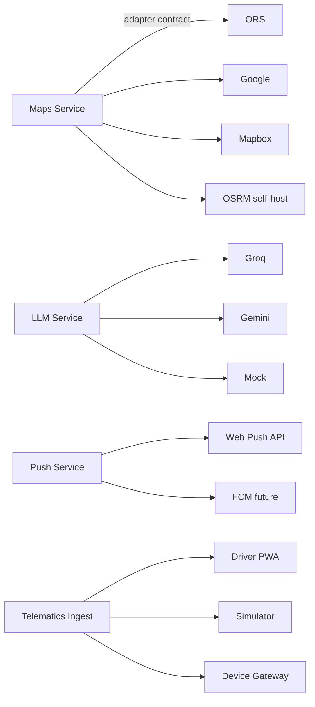

# 12 — Telematics & Integrations

**Owns:** live vehicle location ingestion (GPS source abstraction: driver PWA, dispatch
simulator, telematics device), the Maps/Routing provider abstraction (ORS default,
Google/Mapbox swappable), Geofence matching, ETA computation plumbing, accounting export
format, webhooks, and any external adapter contract surface. Companion docs: `02`
(`vehicle_locations`, `geofences`, `trip_events`), `06` (ETA predictions), `11` (idle-time
emissions derivations), `09` (map screens).

> **Decided posture:** GPS source priority — real browser GPS when on a trip; otherwise the
> dispatch simulator populates idle vehicles. Map/routing provider is **pluggable** behind a
> single adapter interface; default OpenRouteService (free, no-key, demo-safe, can self-host,
  routable offline). Every external callsite is wrapped so any provider failure degrades
  gracefully (`01 §11`).

---

## 1. External Adapter Pattern



Every adapter in `apps/api/src/lib/<external>/` implements a TypeScript interface:
```ts
interface MapsProvider {
  id: 'ors'|'google'|'mapbox'|'osrm';
  route(orig: GeoPoint, dest: GeoPoint, opts?: RouteOpts): Promise<RouteResult>;
  matrix(origins: GeoPoint[], dests: GeoPoint[]): Promise<MatrixResult>;
  geocode(q: string): Promise<GeoCandidate[]>;
  matchNearestRoad(point: GeoPoint): Promise<GeoPoint & { road?: string }>;
  // Tiles handled by the frontend Leaflet provider abstraction (§10).
}
```

A `noop`/`Mock` implementation exists for unit tests + offline-style behavior in CI.
Selection is via `MAPS_PROVIDER` env (default `ors`). All ad-hoc calls *must* go through the
service — no node-fetch to a host from a module.

## 2. GPS Source Priority

### 2.1 Driver PWA GPS (preferred, when on-trip)
On a dispatched trip the driver's app activates `navigator.geolocation.watchPosition` with
`enableHighAccuracy:true, maximumAge:5000, timeout:15000`. The PWA reads:
- duty started after pre-trip pass → service worker wakes the page once an hour even when
  backgrounded (Background Wake Lock API + PeriodicSync where available; backoff where not).
- on each new fix: writes a `trip_events (event_type='position', payload={eta_min,
  distance_remaining_km, lat, lng, speed_kmph, ...})` to the outbox; offline-friendly.
- capturing an odometer via the user prompt at each "checkpoint" action updates the trip's
  `actual_distance_km` on complete with the highest-observed value.

### 2.2 Dispatch Simulator (when no driver GPS available)
Default-on in dev environments; off-by-default in prod. The simulator walks idle vehicles
  toward their home region with subtle movement; on-trip vehicles along their planned
  polyline with realistic speed + noise. Driven by a `lib/simulator/` worker publishing
  `vehicle_positions` to Redis pub/sub; the API ingest endpoint silently accepts
  `source='simulator'`. The simulator stutters via a `paused` flag (admin screen) so demo
  time can be precise.

### 2.3 Real telematics device ingestion
- `POST /telematics/ingest` accepts a generic payload `{ device_id, lat, lng, speed_kmph,
  heading, odometer_km, recorded_at }` authenticated by an API key per device.
- `device_id` maps to a vehicle via `telematics_devices` (table: `id`, `vehicle_id`,
  `api_key_hash`, `vendor`, `metadata`).
- For large-volume vendors we ship source-specific adapters later (Teltonika, GPSGate,
  Queclink) — out of scope v1 except for the API + table existing so adding is a data
  adapter lift rather than a schema change.
- Anomaly / pace checks: any speed >200 kmph or jump >50km/h for 1s → ingestion rejected
  (audit row + ops alert). Stops spoofing or sensor errors from polluting state.

### 2.4 Source precedence
Each vehicle has `vehicle_locations.source` recorded. The most recent entry by `recorded_at`
wins for the map's "latest" surface. When the same vehicle reports from simulator *and* real
PWA at the same moment, `pwa > device > simulator > manual` precedence rules apply per
ingestion:
- `pwa` always wins over the simulator at identical timestamps via ingestion-side tie-break
  by source priority.
- `manual` (admin setting position) is considered a manual override; the manual flag persists
  in `vehicle_locations.source` for visibility.

## 3. Vehicle Location Ingestion

Endpoint variants:
- Internal/telematics: `POST /telematics/ingest` body `{vehicle_id or device_id, lat, lng,
  speed_kmph?, heading?, odometer_km?, source='device'|'pwa'|'simulator', recorded_at}` →
  timestamp engine handled. Returns `202 Accepted` always (we accept the row batch into a
  queue table; doesn't surface to the API DB blocking).
- From driver PWA, location submission is part of the offline-write pipeline (mutation type
  `trip.checkpoint` and background heartbeat `telematics.ping`).

### 3.1 Worker pipeline
```
Redis Stream: vehicle_positions(in)
  ↓
IngestWorker → batches 50 rows → COPY into vehicle_locations using a temp staging table +
 UPSERT-into materialized view vehicle_latest_locations (REFRESH INCREMENTAL on each batch).
  ↓
Emit events: vehicle.position.updated (per vehicle per 30 seconds, throttled to avoid
spamming the WS channel).
```
Throughput target: 200 positions/sec sustained; 1000/sec burst (50–500 vehicle fleet gives
us plenty of headroom).

## 4. Maps Provider — Default ORS + Pluggable

### 4.1 Adapter interface (from §1)

### 4.2 Provider matrix
| Provider | Route | Matrix | Geocode | Mapmatch | Notes |
|---|---|---|---|---|---|
| ORS | ✓ | ✓ | ✓ | ✗ | Free, key req; default. Self-hostable. |
| OSRM | ✓ | ✓ | ✗ | ✓ | Self-hostable demo fallback. No geocode → ORS used for geocode. |
| Google | ✓ | ✓ | ✓ | ✓ | Paid; coverage best. |
| Mapbox | ✓ | ✓ | ✓ | ✓ | Paid; strong styling. |

### 4.3 Configuration surface
- `MAPS_PROVIDER` env selects provider.
- Per-org override encrypts a key in `settings.integrations.maps` (admin-only).
- The adapter factory builds the provider instance per request (or per-worker) from the
  org's resolved config; lazy-Memoized at the worker thread level.

### 4.4 Timeout policy
- 5000ms default for `route()`, 3000ms for `geocode()`.
- On timeout OR error → maps service returns a typed `MapsUnavailable` result; the calling
  service (`trips/route-autofill`, `trips/dispatch-recommendation`, ETA worker) degrades.
- The UI shows inline "Service currently unavailable" with manual entry enabled.

## 5. Geofence Matching

### 5.1 Worker
Subscribes to `vehicle.position.updated` events (throttled 30s/window per vehicle). For
each vehicle position polyline, for each geofence in the vehicle's region+ancestors
geofences, applies point-in-polygon / radius check.

### 5.2 State per `(vehicle_id, geofence_id)`
- `last_entry_at`, `last_exit_at`, `is_inside`, `dwell_seconds`.
- State held in Redis with 24h TTL (rolling) — survives worker restarts, hot in memory.
- On transitions writes `geofence_events` row + publishes `geofence.event`.

### 5.3 Events emitted
| Event | Trigger | Severity |
|---|---|---|
| `enter` | crosses inside | blue (info) |
| `exit`  | crosses outside | blue |
| `dwell` | inside w/ vehicle stationary > `rules.dwell_seconds` default 1800s | orange |
| `idle` | vehicle speed_kmph < 5 for > `rules.idle_seconds` default 600s | orange |
| `unauthorized_stop` | dwell inside `restricted` geofence | red |

### 5.4 Alerting hooks
Each event → notification per `07 §3` `geofence_event` type. Severity-modulated by
`geofences.rules.alerts` configuration.

## 6. ETA Computation

Live ETA for in-transit trips — see `06 §10.1`. The compute path uses the maps adapter:
1. Get remaining polyline to destination from current position — uses `matchNearestRoad`
   for the fix if the maps provider supports it; otherwise straight-line approximation.
2. Speed estimate = EWMA from the last 10 trip_events of type `position` for this trip.
3. Traffic factor (if provider exposes): Google uses `traffic_model`; ORS uses
   `optimized=true`; Mapbox uses `annotate`. Default 1.0 if absent.
4. Result: `eta_min = remaining_distance / speed * (1/traffic_factor_effective) +
   station_delay_assumed_per_stop_count * stops_so_far`.

### 6.1 ETA events
- `trip.etiological ETA change` notification only when ETA delta exceeds
  `predictive_eta.max_delta_min` (default 10 min).
- The ETA worker inserts a `trip_events (event_type='position', payload)` row every 30-60s
  for live tracking + replays.

### 6.2 Re-route suggestion
- Triggered when ETA slips >15% from planned ETA OR live track deviates >5km from the
  polyline OR ETA has slipped >30min absolute.
- Computes alternatives via `route(orig=live_pos, dest, alternatives=true)`; if the best
  alternative gives >10% ETA improvement → emit `route.suggest` notification (`06 §10.2`)
  to dispatch_manager + driver.
- Driver sees an alert + "Preview route" button; accepting updates the trip's intermediate
  polyline + emits a `trip_events (event_type='checkpoint',
  payload={kind:'reroute', new_polyline_id})`.

## 7. Web Push / FCM

Web Push transport — see `07 §2`. Orchestration lives here:
- `lib/push/send.ts` per-user endpoint fan-out. Gateway: `web-push` (Node) using VAPID.
- Devices (subscriptions) registered via `POST /notifications/register-push`. Endpoint
  storage indexed by `(user_id, endpoint_hash)` for unique subscription enforcement.
- 410 Gone → drop subscription from the user. 413/429 → exponential backoff.
- FCM future Android native app will follow the same interface — `PushProvider.send(...)`.

## 8. Email + SMS (out of scope v1; scaffolded)

For the in-app digest channel only in v1. Email/SMS stubbed behind
`lib/notifications/channels/{email,sms}.ts` declarations; full implementations ship behind
`flags.email.enabledFor(orgId)` when SMTP credentials are configured. Same dispatcher loop
handles them (`07 §10`).

## 9. Accounting Export (innovation)

- `GET /reports/export?format=accounting` produces a CSV shaped for popular accounting tools
  (Tally import format) per-org configurable mapping.
- One row per cost-bearing event (fuel log, maintenance log, expense) accept populated with
  the configurable account code mapping in `settings.integrations.accounting.mapping`.
- Posting period determined by `incurred_at`; locked periods (cf. `05 §2.5`) exclude
  retro-exports.

## 10. Webhooks (outbound) + Audit

Webhooks via `POST /webhooks` registration (admin). Trusted website verified by HMAC-SHA256
signature header (`X-TransitOps-Signature: t=<ts>,v1=<hmac>`). Replays attempted with
exponential backoff 1m → 8m → 1h → 4h → 12h → 24h until 200/204 received or 8 attempts.
Dead-letter table `webhook_deliveries` for inspection.

Webhook payload is shape:
```jsonc
{ "event":"trip.dispatched","occurred_at":"...","organization_id":"...",
  "entity":{"type":"trip","id":"..."}, "payload":{...}, "delivery_id":"..." }
```

Payload never includes PII ids (driver_name etc.). Receiver resolves names by following a
known REST resource URL embedded in the payload (`entity.url`).

## 11. Document Storage (S3-compatible)

Documents (`vehicle_documents`, e-POD photos, signatures, reports exports) stored in an
S3-compatible bucket (local MinIO in dev). Key format:
```
tenant/<orgId>/<entityType>/<entityId>/<documentType_or_blobType>/<uuidv7>-<filename>
```

- Pre-signed URLs issued by API with 15 min TTL for uploads; never return long-lived URLs.
-/downloads likewise short-lived, single-use where possible (URL + cookie pair in upgrade
  to download via S3).
- Bucket policy denies public ACLs; server-side encryption (S3 SSE-KMS); bucket versioning
  for documents class only (e-POD retention requires it).
- Max file size: 8MB photos, 20MB PDFs. MIME allow-list enforced client + server + S3 bucket
  policy.
- CORS on the bucket allows the frontend's domain for pre-signed PUT/GET only.

## 12. LLM Adapter

See `06 §7.3` for prose use; plumbing spec here.

### 12.1 Interface
```ts
interface LLMProvider {
  id: 'groq'|'gemini'|'none';
  rewriteProse(payload: {
    structured_recommendation: StructuredRecommendation;
    locale: string;
    profile: 'vehicle_copilot'|'today_report'|'nl_query';
  }): Promise<{ prose: string }>;
}
```

### 12.2 Resilience
- 8 second hard timeout per call.
- Schema-validated output typed against expected JSON.
- VAPID-style secret + key from `settings.integrations.llm` (admin-configured, encrypted).
- Cache key `llm:<orgId>:<profile>:<structured_hash>` with 60min TTL.
- The Mock/none provider returns templated prose from the existing rules path — so the
  prod toggle from LLM→template never breaks the screen.

### 12.3 No vendor lock-in
Every LLM-facing surface uses only the `LLMProvider` interface; switching Groq↔Gemini is an
env change. Adding OpenAI/Claude is a new provider file + env value; no customer of the
interface updates.

## 13. Public API & iFrame Embed (future)

Not in v1. The seams are clean:
- `/api/v1/...` resources all carry the same shape — a public API key gating route wrapper
  intangible scope.
- Embed modules (a chart that can be embedded in customer's portal) consumed via a signed
  iFrame URL → out of scope; documented as v2 absolute goal.

## 14. Audit + Observability of Integrations

- Each external call (maps, LLM, push) writes a `integration_call` log line: provider,
  method, latency, status, trace_id, cost_unit (`01` §9 metrics). Stored sampled in hot
  tables; aggregates in Prometheus.
- Push delivery receipts → Proworks tracker table + dashboard widget for ops to see failure
  rates per platform.
- Telematics ingestion health surfaced on `/healthz` for each ingest worker; on silent
  stream the IngestWorker emits heartbeat metrics showing me: "still alive".
- A ready endpoint `/api/v1/telemetry/info` returns per-provider statuses for the support
  view (admin only, gated by capability).

## 15. Acceptance

- Maps provider failure or timeout does not break Trip Create — the user is invited to enter
  distance manually and is alerted the estimate was unavailable.
- Simulator can be launched cold from `apps/api/src/lib/simulator/cli.ts` even before web is
  booted; populates `vehicles.latest_locations` in <30s.
- A mock LLM provider switching returns templated prose so the screen behaves identically.
- Geofence matcher processes 100 events/sec without losing transitions (verified by an e2e
  convex-hull + radius test fixture path).
- Pre-signed S3 URLs expire; expired URLs return a clear missing-message rather than
  passthrough 403 from S3.
- Telematics ingestion rejects impossible coordinates and emits an audit + ops alert; map pin
  does not jump continent.