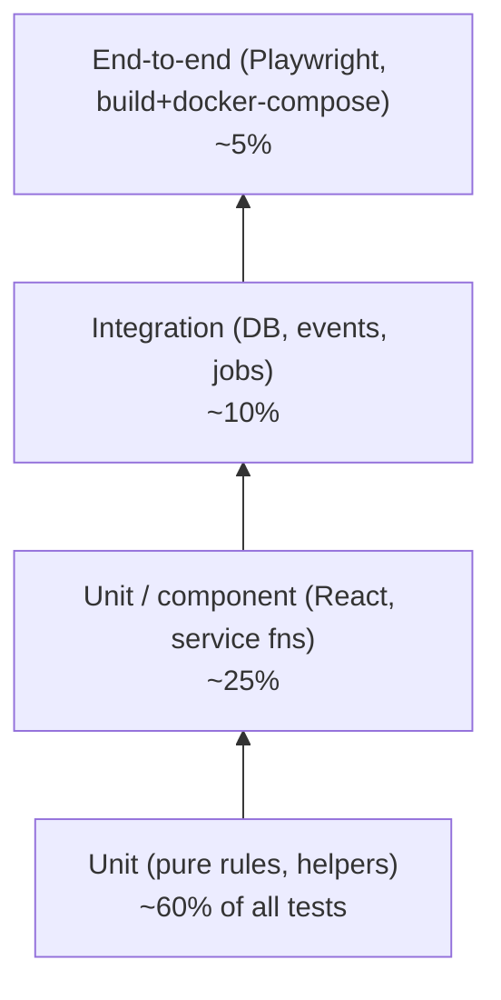

# 13 — Testing & QA Strategy

**Owns:** the test pyramid, fixtures, mocks, coverage gates, the contract-test harness,
end-to-end flows, performance budgets, accessibility checks, visual regression, and the
PR-readiness checklist. Companion docs: `01` (architecture to mock), `14` (CI pipelines
that run these tests), `05` (rule contract tests).

> **Philosophy:** deterministic test types carry the weight; flaky chains are forbidden.
> Property tests where inputs span a domain; golden files where output is large or visual;
> contract tests where two halves of an interface must agree (client ↔ server, server ↔
> DB, server ↔ adapter).

---

## 1. Test Pyramid

| Layer | Tooling | Runs per | Notes |
|---|---|---|---|
| Pure-unit rules | Vitest | file save + per commit | `modules/<x>/rules.test.ts` — no I/O |
| React component | Vitest + Testing Library + happy-dom | file save + per commit | snapshots for visual stabilization |
| Service + DB | Vitest + testcontainers Postgres + Redis | per commit | one ephemeral DB schema per test suite |
| Event subscribers | Vitest + in-memory bus + real DB | per commit | replay idempotency asserts `event_consumers` |
| External adapters | Vitest + MSW (HTTP mocks) + schema validation | per commit | failure-path tests mandatory |
| API contract | Supertest on real server + Postgres | per commit | OpenAPI consumed + RBAC matrix |
| E2E | Playwright in docker-compose | pre-merge | happy path per persona incl offline |
| Visual regression | Playwright snapshot, light + dark, desktop + mobile | per-commit complement | manual approve on intentional changes |
| A11y | axe via Playwright + eslint-plugin-jsx-a11y | per commit | fail-on any violation |
| Performance | k6 load profiles; Lighthouse CI | nightly + pre-prod | budgets enforced |
| Job correctness | Vitest with BullMQ in-memory | per commit | idempotency + DLQ asserts |

## 2. Coverage Gates

- **Statements/branches**: ≥ 80% overall; ≥ 90% on `apps/api/src/modules/*/rules.ts`,
  `apps/api/src/lib/auth/`, `apps/api/src/lib/events/`, `apps/api/src/lib/sync/`.
- Coverage calculated on the *diff* not just the whole codebase; new code must be ≥ 90%.
- PR fails CI if: any rule file change without an updated test; any interface contract
  mismatch; any backward-incompatible schema migration without a paired downgrade test
  asserting the rollback works.

## 3. Fixtures & Factories

- `apps/api/test/factories/` exports factory functions: `makeUser`, `makeDriver`,
  `makeVehicle`, `makeTrip`, `makeFuelLog`, `makeMaintenanceLog`.
- `apps/api/test/fixtures/seed.ts` produces a deterministic ephemeral dataset using v5
  uuids (`uuidv5(slug, NAMESPACE)`) — every test run starts from the same data state.
- Seeding is < 1.5s for the full fixture via batch INSERT + COPY for trip events.
- Reset between tests is `TRUNCATE ... RESTART IDENTITY` within a transaction wrapper that
  rolls back; faster than recreating schema.

## 4. Mocking External Services

- HTTP via **MSW** (Mock Service Worker) for unit + integration where Net calls would
  otherwise fire. Every adapter has a `lib/<external>/<provider>.test.ts` covering:
  success, malformed, timeout (signed = `await sleep(TIMEOUT_MS + 100)`), 5xx, schema
  mismatch, retryable vs non-retryable distinction.
- LLM providers mocked: responds with well-formed JSON success; malformed JSON; timeout;
  empty prose → triggers template fallback within the consumer's path.
- Push mock: successful endpoint + 410 endpoint + 413 endpoint.
- Maps providers mocked the same way; specifically tested against ORS + Google + Mapbox
  shapes since response envelopes differ.

## 5. Contract Tests (interface-anchored)

### 5.1 OpenAPI consumer (frontend)
- `apps/web` ships a CI step `pnpm openapi:check` that snapshots `openapi.yaml` from the
  backend. If backend changes OpenAPI in a breaking way without bumping version, frontend
  build report-mismatches.
- Any frontend client generated by `openapi-typescript` consumes the canonical
  `openapi.yaml`; mismatch TypeScript ↔ API surfaces as a CI error.

### 5.2 DB checksum test
- Compares the live DB schema against the Drizzle schema definition (`drizzle-kit check`);
  drift fails CI. The same step runs against a fresh container PG instance so migrations
  from-zero succeed.

### 5.3 Event contract test
- A test asserts every module declaring `events.ts` declares a topic listed in
  `lib/events/topics.ts`, the payload Zod schema is exported, and at least one subscriber
  declares the same topic with the same payload Zod (cross-file compatible types via TS).

## 6. Rule Tests (the most import-heavy suite — see `05`)

A repeat of the contract; highlight:
- Parameterized test per rule covering: happy + 3 failure variants + 1 edge.
- Property-based tests using `fast-check` for: cargo always rejected above capacity,
  odometer monotonicity, idempotency of scoring workers across re-runs.
- Mutation testing: a run of `stryker` over `rules.ts` is **periodic**, not per-commit (too
  slow); monthly cadence guarding.

## 7. Integration Tests

### 7.1 Service level
Per module an `integration.test.ts` with the real PG (testcontainers), real Redis
(testcontainers), in-memory event bus; asserts:
- Mutations produce the expected entity state + side effects (audit log row, side tables,
  event published with expected payload shape).
- Concurrent competing call (`Promise.all` of two dispatches on same vehicle) serializes
  via locking — second is rejected with proper error code.

### 7.2 Offline sync protocol
- A pair of tests for `push` + `pull`: happy paths, conflicts/rejects, replay (same
  idempotency key returns the same response), oversized batches (split).
- Conflicting mutations → first wins, second returns `OFFLINE_REPLAY_REJECTED` per `04 §8.2`.

### 7.3 External graceful degradation
- Force every adapter route through MSW with the failure of the day; assert the response
  shape degrades correctly (`DOWNSTREAM_UNAVAILABLE`, no blank UI, no unhandled rejection in
  logs).

## 8. End-to-End Scenarios (Playwright)

E2E covers a **persona journey per role** end-to-end against docker-compose stack.

| Scenario | Steps (auto) |
|---|---|
| Fleet Manager dispatch | login → create trip → autofill → use smart dispatch → rule chain green → dispatch → check Vehicle flips to on-trip |
| Driver live trip | driver login → pre-trip with 1 defect block → maintenance open → pass inspection → start trip → checkpoint → e-POD → complete → status flips |
| Offline trip | driver login + force emulator offline → drive sequence → reconnect → data synced within 60s → audit + trip rows |
| Maintenance close | alert banner → vehicle detail → open maintenance prefilled from prediction → close with cost + odometer → vehicle status → available |
| Fuel anomaly | seed outlier fuel log → anomaly card on dashboard + reports → financial analyst acknowledges with reason |
| Notification | force license-expiring seed → daily scan job fires → notification row appears + bell badge updates via WS |
| Reports + export | login financial analyst → reports tab → CSV export → downloaded file has expected rows + columns |
| Map + ETA | trip in transit → simulator advances → ETA panel updates → re-route suggestion surfaces when slip applied |
| Audit | perform any mutation → audit row in `/audit-logs` matches entity + actor + diff |
| Admin settings change | toggle scoring weight → trigger recompute → scores update → audit row with old/new value pair |
| Geofence breach | create restricted geofence → drive vehicle through → unauthorized_stop event surfaces on map + notification fires |
| Multi-role navigation | login as each of 5 personas → only authorized sidebar items visible → unauthorized direct URLs 403 |

### 8.1 Performance test (k6)
- Synthetic load driven against test cluster: 100 simultaneous users, 50 vehicles, 200
  positions/sec ingestion, 20 dispatch/min, 40 fuel logs/min, 30 export requests/hour.
- Targets (server container with 2vCPU / 4GiB): API p95 <250ms on read endpoints, p95
  <600ms on mutations; jobs up-to-date lag <5s (matview refresh catches).
- Spike + soak profiles documented in `performance/load.md`, run nightly on staging.

### 8.2 Lighthouse CI budgets
| Audit | Threshold |
|---|---|
| Performance | ≥ 90 desktop, ≥ 70 mobile |
| Accessibility | ≥ 95 |
| Best Practices | ≥ 90 |
| SEO | ≥ 90 (marketing link pages only — internal routes skip) |
| Largest Contentful Paint | ≤ 2.5s desktop, ≤ 4s mobile |
| Cumulative Layout Shift | ≤ 0.1 |

## 9. Visual Regression / Snapshot

- Peridot snapshot per screen at: light + dark, desktop + mobile.
- Stored under `e2e/screenshots/__screenshots__/`. Committed alongside code; updates must be
  reviewed/approved via CI's "visual diff" artifact (Playwright UI mode dump).
- Ignored areas for transient content: time stamps, ETAs count-downs, position pins (we
  move pins to "frozen" test fixture to make them deterministic).

## 10. Accessibility Tests

- Unit (a11y lint via eslint-plugin-jsx-a11y) — fail-fast per file save.
- Fixture e2e scripts run `axe` checks after each scenario; assert zero violations +
  Attach report artifact.
- Focus-trap tests on Dialog + Sheet; restore-focus tests; tab-order tests using
  `tabable` assertions.
- Keyboard-only flow for E2E: at least one scenario completed entirely with keyboard;
  randomized abridged flows with NVDA + VoiceOver on a bi-monthly cadence (manual).

## 11. Test Database & State Isolation

- Each Playwright parallel session gets its own schema (`test_session_<random>`); the
  per-suite setup creates it; teardown truncates entire schema.
- Cross-session pollution impossible; tests are independent; can be parallelized to
  amortize CI cost.
- Time is mocked at the API level (`lib/time/` with `useFakeTimers()` in unit; in
  integration via `pg CLOCK` option in testcontainers? — no; we instead override a driver
  heartbeat in `lib/time/clock.ts` injected as a functionaliOS dependency in the test
  fixtures).

## 12. PR-Readiness Checklist (per PR)

Required before merge:
- [ ] Coverage gate met on the diff.
- [ ] All public API changes reflected in `openapi.yaml` and any client TS types regenerated.
- [ ] Affected unit + integration tests updated and passing locally.
- [ ] Affected e2e Playwright scenario added or modified; passes on docker-compose.
- [ ] Visual regression reviewed/approved.
- [ ] Audit-log row written for any user-visible state change.
- [ ] New env vars documented in `.env.example`. Secrets only via secret manager (never in
  env.example).
- [ ] Migration up/down both tested against a fresh container.
- [ ] Any new external adapter call has failure-path tests (timeout, malformed, 5xx).
- [ ] Any new notification type has a generator test + localized strings.
- [ ] Any new rule has rule unit tests with parameterized variants; integration test of the
  dispatch chain unaffected.
- [ ] No `console.log` / `print` / leftover TODO/FIXME in the diff.
- [ ] Commits Conventional-Commits style and reviewed (no blind AI paste).
- [ ] RBAC matrix updated and matrix test added if capability was added or modified.

## 13. Acceptance

- A fresh checkout: `pnpm install && pnpm test && pnpm test:e2e && pnpm test:a11y &&
  pnpm test:load` exits 0 in <15min on a developer laptop.
- No tests are skipped/`xit`/`.only` committed on trunk.
- Each shipped feature has a representative E2E scenario; failure of any of these blocks
  deploy.
- A passing nightly run on staging is the gate before any prod deploy — see `14 §3`.
- Performance budgets enforced; a k6 nightly run exceeding thresholds fails staging
  deployment (safety net).