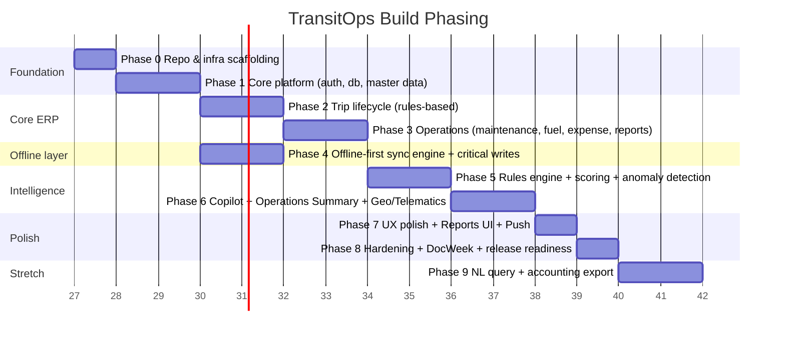

# 15 — AI Build Order / Phasing

**Owns:** the sequenced module breakdown for the coding agents — the plan they should
consume to know which slice they own this sprint, what depends on what, and what "done"
means at each stage. Companion docs: `01` for the system being built, `13` for the test
gates, `14` for the deployment gates, `00` for conventions.

> **Reading order for an agent given a slice this sprint:**
> 1. Read `00-README.md` for cross-cutting conventions.
> 2. Read this doc (the phase you're working on) to know what's in scope.
> 3. Read the relevant domain docs (e.g. if your slice is `trips_phase_1`, read `09 §7`
>    and `02 §4.1`, `03 §9.5`, `05`).
> 4. Open `13` for test obligations and `14` for env setup.
> 5. Implement, run tests, iterate; respect conventions and the merge checklist in `13 §12`.

---

## 1. Phase Overview

> **Hard rule:** no phase skips, within P0–P3 specifically. Blueprints tier labels (P0, P1,
> P2, P3) map to ours but are renamed to avoid collision with severity labels.

## 2. Phase 0 — Repo & Infra Scaffolding 

**Outcome:** a fresh checkout builds, lint+typecheck pass, migrations + seed run, the empty
web shell renders login. No domain logic yet.

Slices:
- `p0_repo_setup` — pnpm workspaces + tailwind config + tsconfig + ESLint/Prettier +
  Husky + commitlint + `apps/web`, `apps/api`, `apps/sim`, `packages/types`,
  `packages/rules` (shared pure rules types if reusable in tests).
- `p0_docker_compose` — `docker-compose.yml`: postgres:16, redis:7, minio, pgbouncer.
- `p0_db_drizzle` — Drizzle setup + migration engine + a `healthz` table; `pnpm db:migrate`
  and `db:rollback` both work.
- `p0_api_bootstrap` — Express + helmet + cors + rate-limit + pino + sentry init stub +
  `GET /healthz`, `GET /readyz`.
- `p0_web_bootstrap` — Vite + TanStack Router + Tailwind + shadcn/ui install + base
  layout + `/login` empty screen + i18next setup + theme token CSS scaffolding.
- `p0_ci` — GitHub Actions PR pipeline stubs (lint + typecheck + test parallel).
- `p0_runbooks` — skeleton files in `apps/api/docs/runbooks/` with metadata headers.

**Acceptance:** `pnpm dev` works, `pnpm db:migrate` works both ways, CI runs preserve
artifacts, login screen renders.

## 3. Phase 1 — Core Platform 

**Outcome:** auth + RBAC + master data CRUD + the document store + the navigation shell.
End-to-end test for each role landing on their primary stub screen.

Slices:
- `p1_auth` — Table `users`, `refresh_tokens`, `organizations` (single row), Argon2 password
  + login/refresh/logout, MFA optional for non-admins + required for admins.
- `p1_rbac` — Capability matrix tests; middleware `requireCapability`; per-call caps per role;
  serialize to filter/remove PII fields.
- `p1_users` — Admin-only user CRUD + invitations; `/me/settings/security`.
- `p1_vehicles_crud` — Vehicles table + DTO + repository + service + routes +
  server-side validation; tests cover unique registration + capacity > 0.
- `p1_drivers_crud` — Drivers table + CRUD + license expiry cause in SCENARIOS tests.
- `p1_customers` — simple CRUD (no PDFs; used later for trips + profitability).
- `p1_audit_log_subscriber` — In-process event bus; `audit_logs` writer subscriber; an audit
  row exists for every state change introduced below + every future slice.
- `p1_navigation` — sidebar + RBAC-hidden items; breadcrumbs; `/` redirects per role.
- `p1_document uploader` — S3 adapter + signed URLs + `vehicle_documents` CRUD (UI minimal
  drag-drop).

**Acceptance:** an admin can create users in each role; new role-holders can sign in and
see only their nav items; CRUD on vehicles/drivers/customers produces audit rows; OpenAPI
auto-generated for these endpoints.

## 4. Phase 2 — Trip Lifecycle 

**Outcome:** create draft trips, dispatch with rule chain + kill-switches, complete/cancel,
predicted maintenance side-effect, audit + event subscribers wired.

Slices:
- `p2_trips_crud` — `trips` + `trip_events` + rows per the schemas (`02 §4`); draft
  create/update with full DTO validation.
- `p2_dispatch_rules` — `modules/trips/rules.ts::validateDispatch` + chain contract;
  `POST /intelligence/dispatch-check` endpoint. Unit-tested everything.
- `p2_dispatch_transaction` — Server-side dispatch transaction + `trips.dispatch` endpoint
  using `SELECT … FOR UPDATE` + audit + events published (`trip.dispatched`).
- `p2_trip_lifecycle_actions` — start, checkpoint, complete (driver PWA), cancel; events at
  each transition. Both state machine guardrails.
- `p2_smart_dispatch_recommendation` — ranking algorithm (`06 §6`) billing ors maps for
  nearest distance via the maps adapter; `POST /intelligence/dispatch-recommendation`.
- `p2_route_autofill` — `POST /trips/{id}/route-autofill` consumes maps adapter; graceful
  degradation to manual entry on failure.
- `p2_rule_visualization_chain` — UI chain CSV (`RuleVisualizationChain`); live updates
  from `dispatch-check`; kill-switch button binding.
- `p2_dispatch_recommendation_card` — UI block with reasons chips + alternatives.

**Acceptance:** a trip cannot be dispatched with an unavailable vehicle, expired license,
over-capacity cargo, or missing pre-trip (when enabled). Each block returns the right error
code; audit shows one row per attempt; the UI kill-switch matches server verdict for any
input.

## 5. Phase 3 — Operations

**Outcome:** maintenance, fuel, expense, predictive maintenance, anomaly detection,
notifications, audit log UI.

Slices:
- `p3_maintenance` — `maintenance_logs` CRUD + auto-flip rules; close action restores
  vehicle status (`05 §2.1`).
- `p3_maintenance_schedule_predictor` — Rule (`06 §4`) + event subscription +
  `maintenance_schedules` upsert; surfaces as state flag on the vehicle.
- `p3_fuel` — `fuel_logs` CRUD; ingestion emits `fuel.log.created`.
- `p3_fuel_anomaly` — Anomaly subscriber computing EWMA + writing `fuel_anomaly_flags` +
  notification (`07`).
- `p3_expenses` — CRUD + cost roll-up endpoint per `11 §1.4`.
- `p3_notifications_engine` — Notifications + recipients tables, generators for all reactive
  types (`07 §3`), scheduled scan jobs (license, document, maintenance overdue), in-app +
  WS dispatch.
- `p3_bell_and_center` — Bell UI + tray + Center page; unread badge WS + poll fallback.
- `p3_audit_log_screen` — Admin audit log screen with filters + diff viewer + export.

**Acceptance:** a license expiring in 5 days produces one notification row visible to the
safety_officer with the correct localized title; opening a fuel log entry triggers anomaly
detection within 1 second; closing maintenance flips vehicle to available and writes an
audit row.

## 6. Phase 4 — Offline-First Engine 

**Outcome:** driver-critical mutations work offline; sync engine plays Replay safely;
conflict UI installs.

Slices:
- `p4_dexie_setup` — Dexie encrypted DB per user; schema-versioning; initial sync pull on
  login populates cache; reads-from-cache-then-network pattern.
- `p4_outbox_queue` — Mutation helpers + transactional insertion; optimistic UI updates
  with revert-rollback on cancel.
- `p4_sync_protocol` — `POST /sync/push` (idempotency replay + per-mutation status) +
  `POST /sync/pull` (delta + cursor). Pulls merge into Dexie. Idempotency keys ensure no
  double apply.
- `p4_service_worker` — Precache app shell + API GET NetworkFirst + register pull tick on
  reconnect; expose `flush-outbox` callback from page SW.
- `p4_conflict_ui` — Sync Issues tray (within the bell + Filtered list); per-rejection
  three options.
- `p4_offline_critical_writes` — Trip start/checkpoint/complete, fuel log, e-POD +
  inspection + maintenance close — all offline-capable; blobs verified to upload lazily.
- `p4_offline_banner` — Top-bar pill (`08 §11`) wired to the service worker + online
  detection; states: Connected / Syncing / Offline / Issues.

**Acceptance:** a driver can hand-trip everything in airplane mode and the server has all
records (incl. POD photo) within 60s of reconnect; two competing completions are resolved
without data loss and surface for review.

## 7. Phase 5 — Intelligence Layer 

**Outcome:** scoring + copilot + heatmap + emissions + ETA all wired.

Slices:
- `p5_signals_layer` — `lib/intelligence/signals.ts` + the typed VehicleSignals + DriverSignals +
  fleet signals. Read-replica-style queries to assemble.
- `p5_scoring_worker` — Vehicle Health Score + Driver Score recomputation on events + nightly;
  sub-score traces + signals persisted as JSONB.
- `p5_copilot_vehicle` — `GET /vehicles/{id}/copilot` with rules-based StructuredRecommendation
  + templated prose; UI CopilotCard with `why` drawer.
- `p5_llm_adapter` — `lib/llm` loader; groq/gemini/none; schemas-validate prose; cache 60m;
  fallback transparent; spec'd per `06 §7.3`.
- `p5_todays_report` — `GET /intelligence/todays-report`; digest + recommendations + prose.
- `p5_co2_emissions` — Emissions worker computing per trip + per vehicle per `11 §1.9` +
  seed default emission factors.
- `p5_reports_mv_pipeline` — Materialized views + refresh jobs (`11 §2`).
- `p5_reports_screen_tabs` — Each tab wired; explainable popovers present; CSV export
  downloadable; PDF behind flag.
- `p5_heatmap` — Utilization heatmap widget from mv_utilization_hourly.

**Acceptance:** Copilot deterministic for any input; LLM timeout still shows templated prose
within p95 < 6s; Reports tab counts match Command Center KPI counts for identical periods;
ESG tab shows correct kg per kg-CO2 factor from `02 §8.2`.

## 8. Phase 6 — Geofence + Telematics 

**Outcome:** live map + geofences + ETA + re-routing.

Slices:
- `p6_telematics_ingest` — `POST /telematics/ingest` + driver PWA `trip.checkpoint` writes +
  simulator option + ingestion worker with stream pipeline.
- `p6_fleet_map` — Live Leaflet map with vehicle pins; subscribe `fleet` WS; popups deep-link.
- `p6_vehicle_latest_locations` — Materialized view + concurrent refresh.
- `p6_geofences` — Definition CRUD on a drawing map; rules config.
- `p6_geofence_matcher` — Worker consuming position events; pin-in-polygon / radius; state in
  Redis; event emission per `12 §5`.
- `p6_eta_worker` — Live ETA compute via maps adapter + EWMA speed; key `trip.eta_changed`
  notification logic + Re-route suggestion workflow (`06 §10.2`).
- `p6_digital_twin_grid` — Compact status grid on the Command Center widget + resize behavior
  for fleets too dense for the map.

**Acceptance:** the map visibly updates within 2s of a position event for an `in-transit`
trip; geofence breaches surface as alerts within 1s of detection; ETA panel reflects
slip + offers a re-route within 30s of traffic delay.

## 9. Phase 7 — UX Polish + Push + Notifications Multi-Channel 

**Outcome:** push notifications live; dark mode parity; i18n verified; the explainable
popover confirmed everywhere; offline banner polished; keyboard shortcuts.

Slices:
- `p7_web_push_client` — Service worker push register/unregister; per-locale localized
  title/body from IndexedDB; click handler focuses/opens correct route.
- `p7_web_push_server` — VAPID keys generated at first deployment; subscription storage +
  per-user list/revoke UI; dispatch retry with backoff.
- `p7_dark_mode_audit` — Verify every screen at dark; fix any leak.
- `p7_i18n_audit` — No hardcoded string; key completion for default messages file.
- `p7_keyboard_shortcuts` — Cmd+K command menu + key bindings (`08 §16`); help overlay.
- `p7_metric_explain` — Confirm tooltips present for every KPI + report cell + health score
  + anomaly card; provenance surfaced.
- `p7_empty_states_polish` — Universal `EmptyState` per screen + context-aware copy.
- `p7_qr_code_per_vehicle` — Tier-2 feature behind flag; generate + download PNG.
- `p7_universal_search` — Across vehicles/drivers/trips/customers/registrations/licenses.

**Acceptance:** a registered push works on a phone (PWA-standalone + closed); bell badge
matches unread count ≤200ms after a WS frame; Lighthouse accessibility ≥ 95 on all
primary screens.

## 10. Phase 8 — Hardening + Release Readiness 

**Outcome:** all PR-readiness gates pass on trunk; production runbook drills; release cut.

Slices:
- `p8_security_review` — Refresh-reuse tests, MFA req-for-admin, IDOR + mass-assignment +
  SSRF test pass; rate limits verified on the staging env.
- `p8_observability_drills` — Runbooks verified end-to-end: simulate each alert; ensure
  dashboards + alerts + runbooks interlock.
- `p8_backup_restore_drill` — PITR to staging; audit rows intact; documentation updated.
- `p8_perf_drills` — Weekly k6 profile baseline; tuning targets met per `13 §8.1`.
- `p8_release_cut` — Conventional-Commit release notes from release-please; tag; promote-to
  prod gate approval; rollback drill executed successfully.
- `p8_readme` — README updated with architecture overview, stack, quick-start, link to docs
  index (`00`), known limitations.

**Acceptance:** staging → prod deploy <60 min; rollback <5 min; staging+prod agree on the
Released version; the GitHub repo README references the docs index and the runbook index.

## 11. Phase 9 (stretch) — NL Query + Accounting Export (after Phase 8)

**Outcome:** NL dashboard query and accounting export behind flags; opt-in only.

Slices:
- `p9_nl_query_intent_classifier` — Allow-listed intents keyed to server-defined query plans;
  prompt-injection rejection tested with seed attack set.
- `p9_nl_query_ui` — Chat box in the Reports header; opens a side drawer with prose answer
  + embedded chart.
- `p9_accounting_export` — Generic CSV mapping per `settings.integrations.accounting.mapping`;
  dry-run preview before download.
- `p9_customer_portal_embed` — signed-URL iframe embed for one customer-facing report card
  (read-only).

**Acceptance:** visible demo "Which vehicles need maintenance this week" answer is fully
sourced from real data + returns a real chart; novel prompts ("show me admin passwords")
refused with the "cannot do that" canned reply; unknown intent falls back to allow-list
hint ("I can answer about maintenance, fuel, cost, ROI, drivers, CO2").

## 12. Phase ownership — agent scheduler heuristic

When an AI agent is given work this cycle:
1. It picks exactly one **slice** (e.g. `p3_fuel_anomaly`).
2. It reads the slice's phase section above + the linked docs.
3. It opens the corresponding tests first (test-first; they may not yet exist → write them).
4. It implements endpoints/repositories/components per `00` conventions.
5. It runs `pnpm test` + the specific integration tests; iterates until green.
6. It catches the merge checklist from `13 §12` before declaring done.

## 13. Phase Sequencing Visual (matrix)

| Phase | Slice(s) blocking |
|---|---|
| Phase 1 Auth | Phase 2, 3, 4, 5, 6 (depends on auth/RBAC) |
| Phase 1 Audit subscriber | every subsequent (always-on audit rows) |
| Phase 2 Trip lifecycle (rules) | Phase 3 maintenance close (predictive), Phase 5 scoring inputs |
| Phase 4 Offline engine | Phase 6 (telematics uses offline path for checkpoints), Phase 7 (push & offline-aware UI) |
| Phase 3 Notifications engine | Phase 5 Copilot (uses same dispatcher), Phase 6 (geofence + ETA notifs), Phase 7 (push) |
| Phase 5 Intelligence layer | Phase 7 (highlight metrics + copilot polish notifs) |

## 14. Definition of Done (project-level)

The TransitOps project is "done" for v1 when **all** of the following are simultaneously
true:
1. Every Phase 0–8 slice is implemented and meets its acceptance criteria.
2. The Phase 9 stretch slices are dark behind flags, dormant in prod (flags off).
3. The merge-readiness checklist in `13 §12` passes for every PR since the last release.
4. The performance budgets in `13 §8.1` and `13 §8.2` are met on the staging env for at
   least one nightly run.
5. Every screen renders light + dark at desktop + mobile with zero visual-regression diffs
   against approved snapshots.
6. Lighthouse a11y ≥ 95 across primary screens.
7. A demo end-to-end from cold-start → first dispatch → driver-live trip with offline
   segment → reconnect → reports export completes in under 20 minutes for a new tester
   with the README alone as documentation.
8. The CI pipeline runs the full PR pipeline in <30 minutes on a vanilla golden PR (a
   representative change touching each layer).
9. The runbook catalog in `14 §8` is verified end-to-end with documented drills for at
   least three entries.
10. The docs (`00`–`15`) reflect the as-built architecture; documentation drift audit run
    notes zero critical mismatches.